# Implementation on 4 Machines — Evidence Appendix

**Document:** 4-machine implementation
**Capture window:** 3–5 September 2026
**Contents:** IMG-001 through IMG-018
**Credential handling:** No password, key, token, or secret is visible in any capture. Where a password prompt appears, no value is shown.

---

## How This Appendix Is Used

Each capture below is given a reference, the system it documents, a statement of what it proves, and the Logbook rows and Checklist items it supports. References are stable — if a capture is replaced, the replacement keeps the same reference so that the other documents do not need reworking.

> **A note on what counts as evidence:** Several of these captures record a deliberate verification rather than a passive screenshot. In IMG-004, the operator attempts connections that should fail and shows them failing, then shows the one permitted path succeeding. In IMG-010, IMG-011, IMG-012, and IMG-016, a uniquely marked event is written on the source host and then retrieved by name in Splunk. Evidence of that kind proves the specific path end to end, which a screenshot of a working dashboard does not.

---

## IMG-001 · ERPNext — Ubuntu 24.04.4 LTS (192.168.100.113)

**What this capture shows:** Base application build in progress: Node.js v18.20.8 confirmed, yarn installed globally, and a dedicated non-root `frappe` service account created and added to the sudo group.

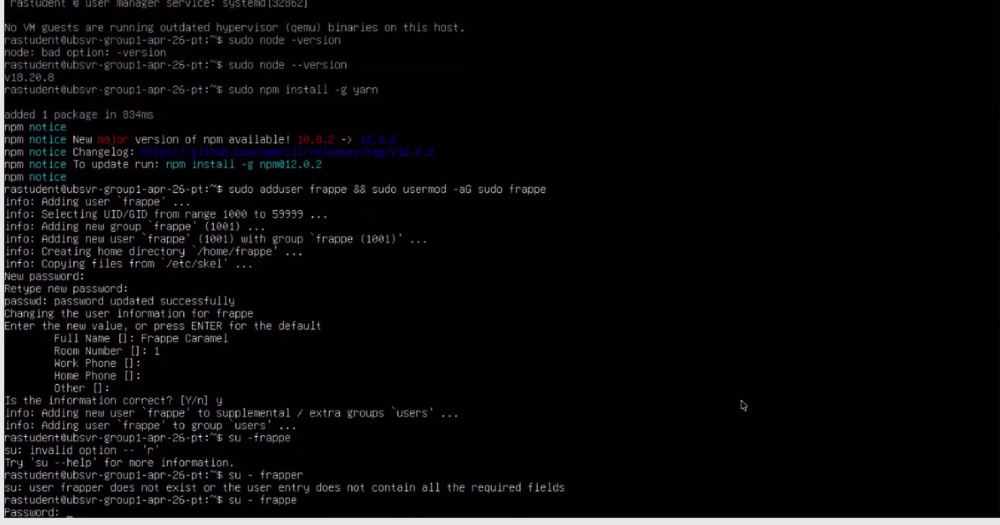

*IMG-001 — ERPNext — Ubuntu 24.04.4 LTS (192.168.100.113)*

---

## IMG-002 · ERPNext — Application Exposure

**What this capture shows:** The Frappe login page for `erp.meridianvault.local` served over HTTPS. "Create a Frappe Account — Signup Disabled" confirms public self-registration is turned off. The browser padlock warning is the basis for open item OI-5, since the certificate is not issued by a trusted authority.

**Supports:** Logbook A2 · Checklist §2 "Application exposure", §3 "DMZ exposure"

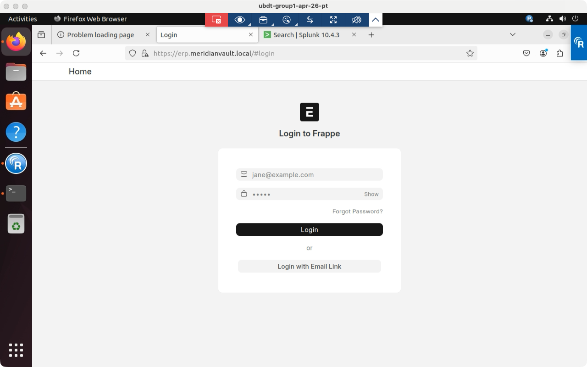

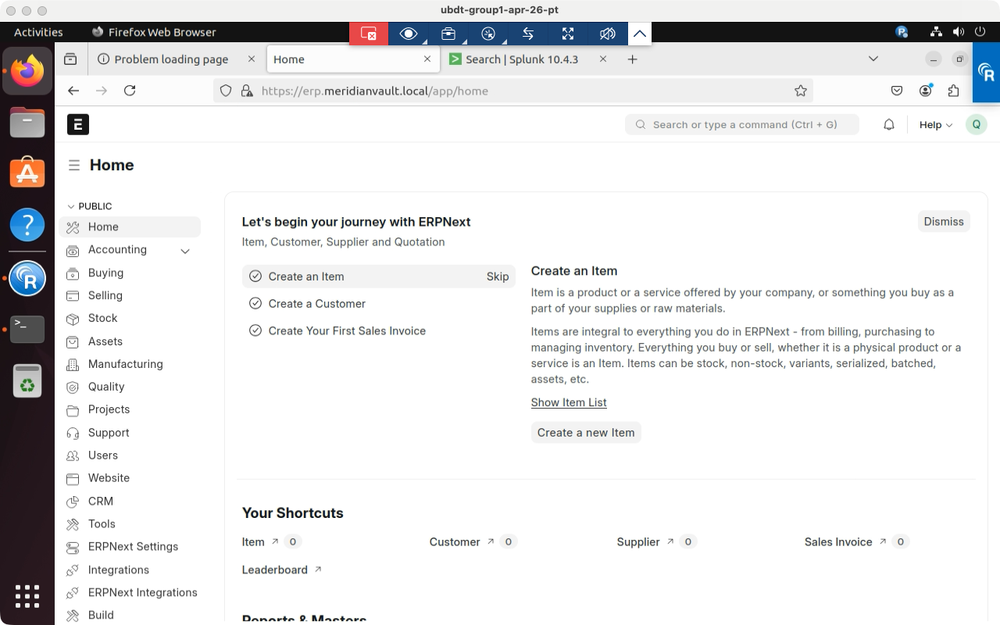

*IMG-002 — ERPNext — application exposure*

---

## IMG-003 · PostgreSQL 18.6 — Windows Server 2025 (192.168.100.125)

**What this capture shows:** Connection information for the application session: database `meridian_vault_control`, client user `erpnext_svc`, SSL connection true, TLS 1.3 with `TLS_AES_256_GCM_SHA384` and a 256-bit key, and — the important line — Superuser: off. This is the evidence that the least-privilege role works as intended.

**Supports:** Logbook A4, A5 · Checklist §2 "Database transport security", "Database least privilege"

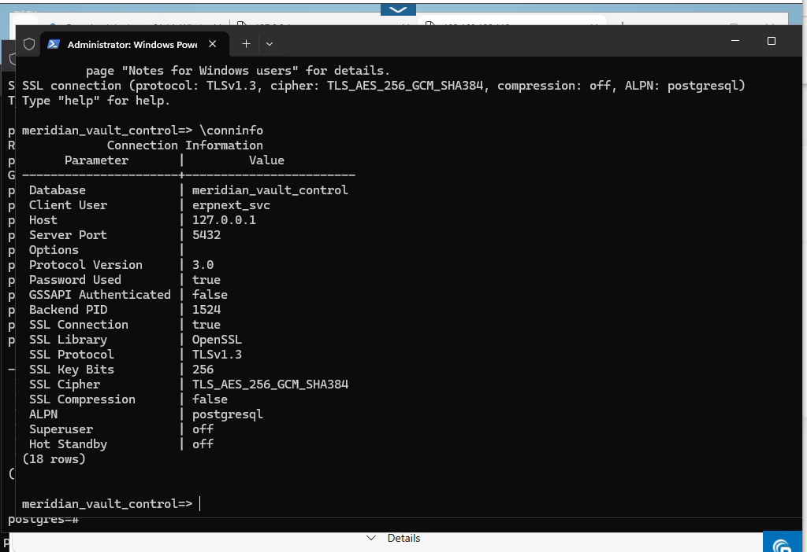

*IMG-003 — PostgreSQL 18.6 — Windows Server 2025 (192.168.100.125)*

---

## IMG-004 · PostgreSQL — Host-Based Access Control

**What this capture shows:** A remote connection sequence run from the ERPNext server. The failures are the point: `pg_hba.conf` rejects connections for the wrong role and for a host that is not listed, and reports "no encryption" where TLS was not requested. The final attempt, using the exact permitted database, role, and source, succeeds over TLS 1.3. Both the deny path and the allow path are demonstrated in one capture.

**Supports:** Logbook A7, A8, C3 · Checklist §2 "Database host-based access control", §3 "Segmentation tripwire U3"

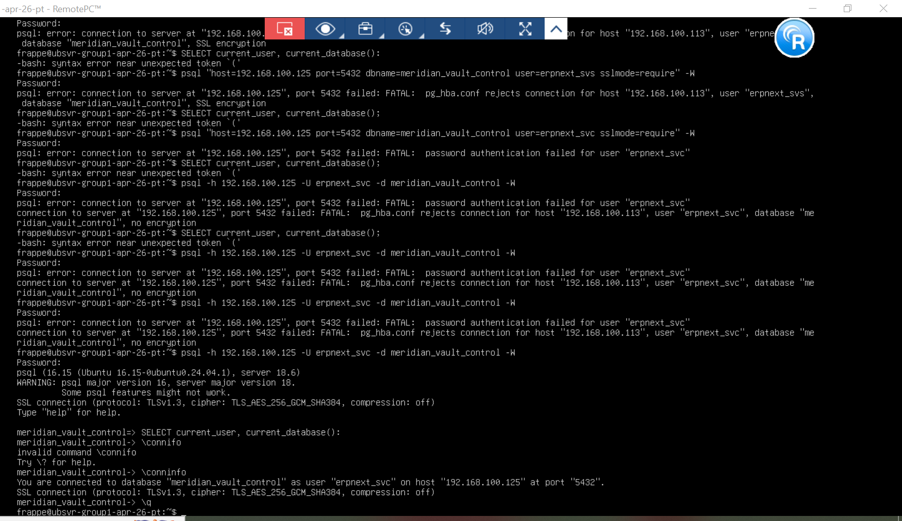

*IMG-004 — PostgreSQL — host-based access control*

---

## IMG-005 · Windows Defender Firewall — Database Host

**What this capture shows:** The rule "MVF PostgreSQL from ERPNext" listed as Enabled, Inbound, Allow, profile Any, with the address filter showing RemoteAddress restricted to 192.168.100.113. This is the host-layer implementation of designed rule D1, and the absence of any other allow rule is what implements the intent of tripwire U3.

**Supports:** Logbook C2 · Checklist §3 "Database access restriction", "Segmentation tripwire U3"

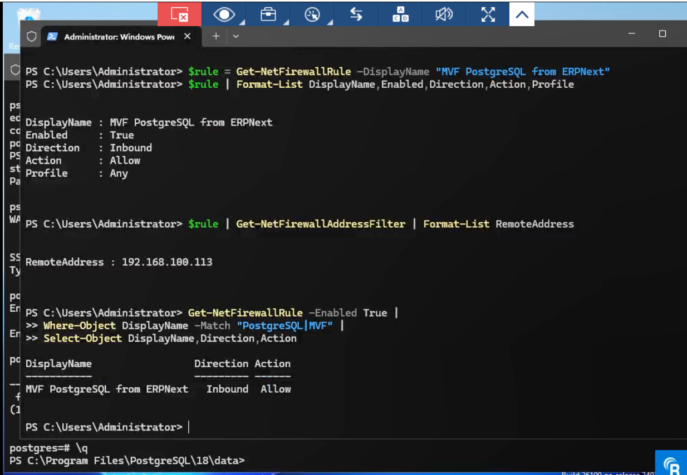

*IMG-005 — Windows Defender Firewall — database host*

---

## IMG-006 · Splunk Enterprise — SIEM Host

**What this capture shows:** Splunk Web home page reachable, confirming the instance is running and serving the console.

**Supports:** Logbook A11 · Checklist §5 "SIEM operational"

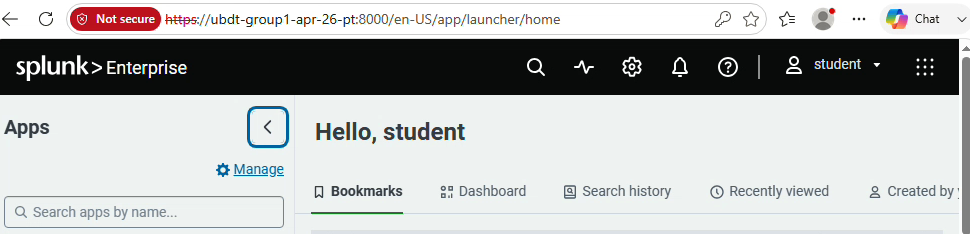

*IMG-006 — Splunk Enterprise — SIEM host*

---

## IMG-007 · Splunk Enterprise — Management Interface

**What this capture shows:** Splunk Web served at `192.168.100.120:8000`. The "Not secure" indicator in the address bar is the basis for open item OI-6 — the console is currently served over HTTP.

**Supports:** Logbook A12 · Checklist §2 "SIEM management plane"

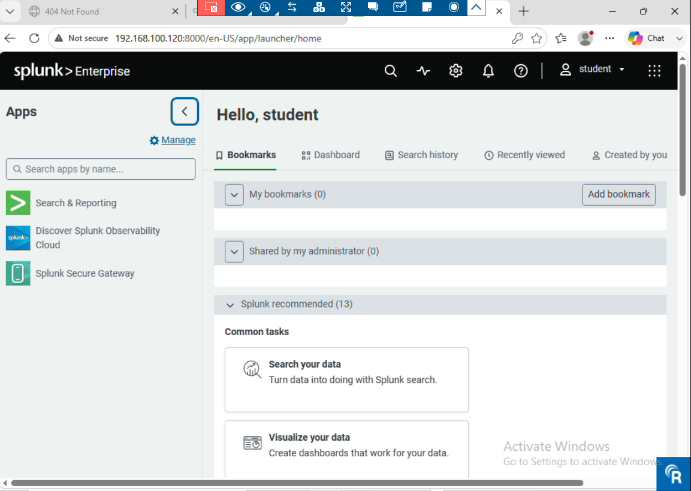

*IMG-007 — Splunk Enterprise — management interface*

---

## IMG-008 · Splunk — Network Listeners

**What this capture shows:** Output of `ss -tulnp` on the SIEM host showing `splunkd` bound to `0.0.0.0:1514` on UDP and `0.0.0.0:9997` on TCP. This confirms both ingestion paths are actually listening, rather than merely configured.

**Supports:** Logbook A13 · Checklist §5 "SIEM operational"

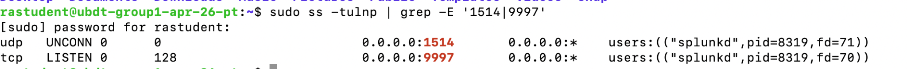

*IMG-008 — Splunk — network listeners*

---

## IMG-009 · Splunk Universal Forwarder — Windows 10 Endpoint

**What this capture shows:** Unattended forwarder installation via `msiexec` with the Application, Security, and System channels enabled, followed by creation of the outbound TCP 9997 firewall rule and confirmation of the hostname `DESKTOP-T7E8MSJ`. Note the `RECEIVING_INDEXER` value in the command line — this is the discrepancy recorded as open item OI-2.

**Supports:** Logbook A14, C4 · Checklist §3 "Forwarder path" · Open item OI-2

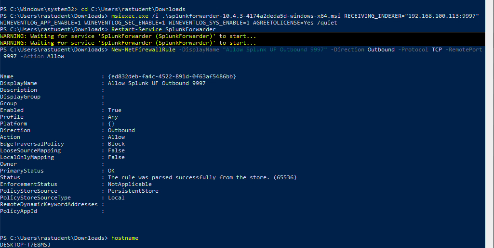

*IMG-009 — Splunk Universal Forwarder — Windows 10 endpoint*

---

## IMG-010 · Sysmon and Forwarder — Windows Host

**What this capture shows:** Sysmon 15.21 installed with a validated configuration and the Sysmon64 service confirmed Running, local Process Create events read back from the operational channel, the SplunkForwarder service reconfigured to LocalSystem so it can read that channel, and a marked `SYSMON_TEST_EVENT` generated for end-to-end verification.

**Supports:** Logbook A15, B5 · Checklist §2 "Endpoint telemetry", §5 "Endpoint telemetry"

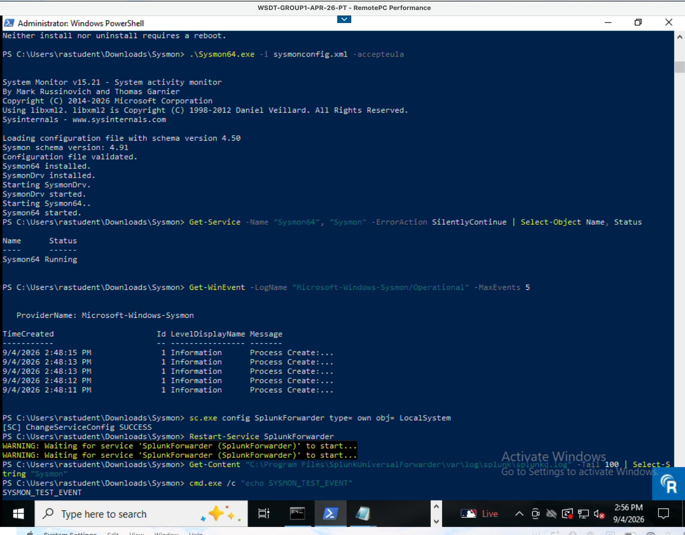

*IMG-010 — Sysmon and forwarder — Windows host*

---

## IMG-011 · Splunk — ERPNext Application Ingestion

**What this capture shows:** A uniquely marked line written to the Frappe web error log on the ERPNext host and then retrieved in Splunk, showing host, source path `/home/frappe/erpnext-bench/logs/web.error.log`, and sourcetype `frappe:web:error`. The terminal that generated the event is visible below the search, so the whole path is evidenced in one capture.

**Supports:** Logbook D3 · Checklist §5 "ERPNext application logs"

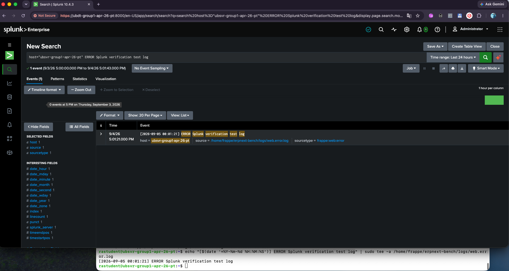

*IMG-011 — Splunk — ERPNext application ingestion*

---

## IMG-012 · Splunk — Linux Syslog, UFW and System Events

**What this capture shows:** Marked verification events — `[UFW BLOCK]`, `[SYS CRITICAL]` — generated with `logger` on 192.168.100.113 and retrieved in Splunk with source `udp:1514` and sourcetype `syslog`. Confirms the rsyslog forwarding path and the firewall-deny visibility it carries.

**Supports:** Logbook A17, C5, D5 · Checklist §3 "Firewall logging to the SIEM", §5 "Linux syslog and firewall denies"

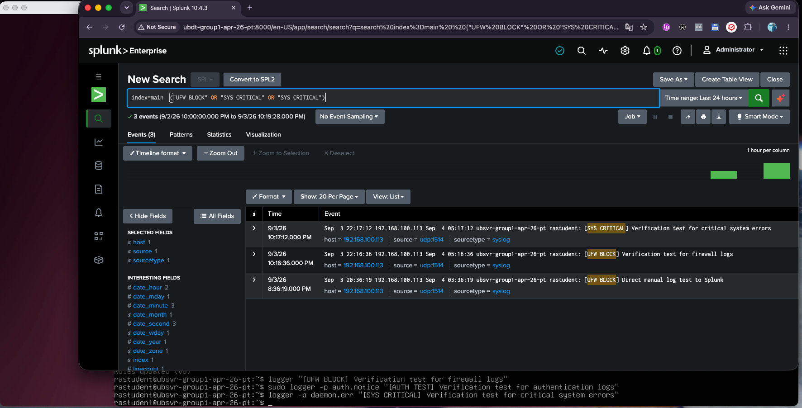

*IMG-012 — Splunk — Linux syslog, UFW and system events*

---

## IMG-013 · Splunk — Linux Interactive Command Auditing

**What this capture shows:** `bash_command` events searchable in Splunk, showing individual commands executed on the ERPNext host with timestamps and originating address. This is the Linux counterpart to Windows Event ID 4688 command-line auditing.

**Supports:** Logbook A18, D7 · Checklist §5 "Linux command auditing"

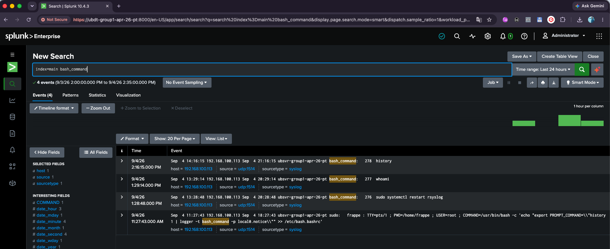

*IMG-013 — Splunk — Linux interactive command auditing*

---

## IMG-014 · Splunk — Whole-Estate Ingestion Verification

**What this capture shows:** `index=* | stats count by sourcetype` returning 16,275 events across ten sourcetypes in a 24-hour window: Windows Application, Security and System; PowerShell Operational; Sysmon on both the classic and XML sourcetypes; `frappe:web:error`; `nginx:plus:error`; `postgresql:log`; and `syslog`. Every deployed system is represented. The presence of two Sysmon sourcetypes is the duplicate-ingestion observation noted in the Configuration Report §4.2.

**Supports:** Logbook D1, D4 · Checklist §5 "All expected log sources ingesting", "PostgreSQL logs"

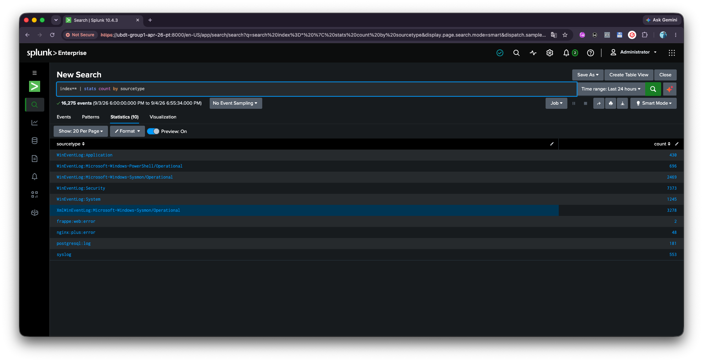

*IMG-014 — Splunk — whole-estate ingestion verification*

---

## IMG-015 · Splunk — Per-Host Ingestion Verification

**What this capture shows:** `index=main | stats count by host, sourcetype` returning 23,656 events, with `DESKTOP-T7E8MSJ` and `WIN-1GCHPNLQP84` each reporting Application, Security, and System channels, and `192.168.100.113` reporting syslog. Confirms that ingestion is distributed across the estate rather than concentrated on one noisy host.

**Supports:** Logbook D2 · Checklist §5 "All expected log sources ingesting"

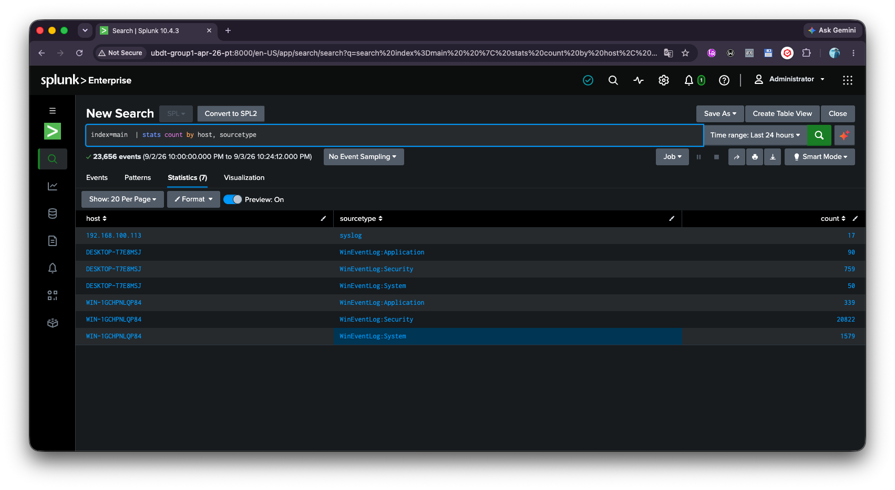

*IMG-015 — Splunk — per-host ingestion verification*

---

## IMG-016 · Splunk — Endpoint Verification by Marked Event

**What this capture shows:** `index=main SYSMON_TEST_EVENT | stats count by host` returning both Windows hosts. The deliberately marked command was executed on each host and located in Splunk by name, proving the endpoint-to-SIEM path individually for each machine.

**Supports:** Logbook D6 · Checklist §5 "Endpoint telemetry"

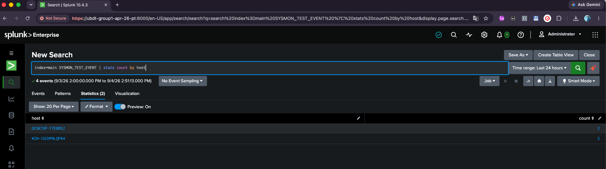

*IMG-016 — Splunk — endpoint verification by marked event*

---

## IMG-017 · Windows Update — Windows Server 2025 (WIN-1GCHPNLQP84)

**What this capture shows:** `Install-WindowsUpdate -AcceptAll -AutoReboot` executed from an elevated PowerShell session, with seven updates accepted and download under way. Captured 3 September 2026 at 15:55.

**Supports:** Logbook E1 · Checklist §4 "Windows Server 2025 patched"

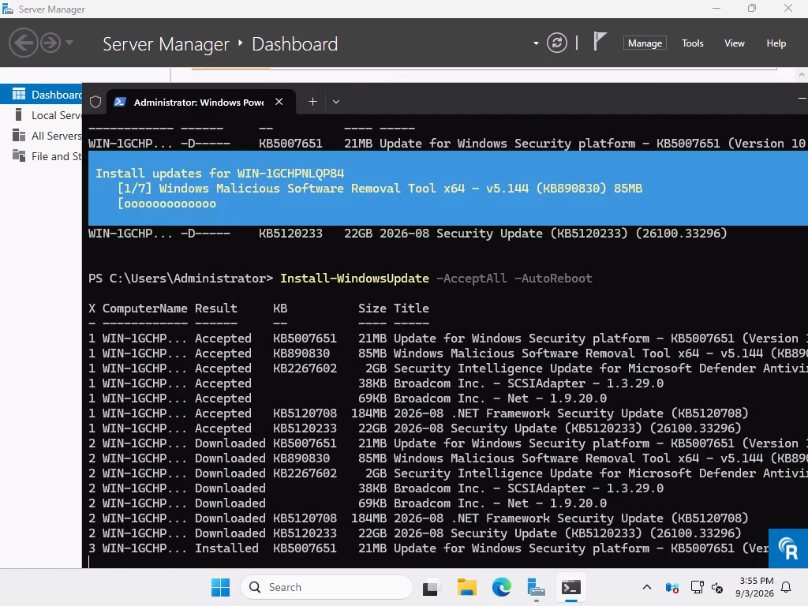

*IMG-017 — Windows Update — Windows Server 2025 (WIN-1GCHPNLQP84)*

---

## IMG-018 · Windows Update — Windows Server 2025 (WIN-1GCHPNLQP84)

**What this capture shows:** The same run at completion, showing all seven updates progressing to Installed, including KB5120233 which takes the host to build 26100.33296, and KB5120708 for the .NET Framework. Captured 3 September 2026 at 16:07.

**Supports:** Logbook E1 · Checklist §4 "Windows Server 2025 patched"

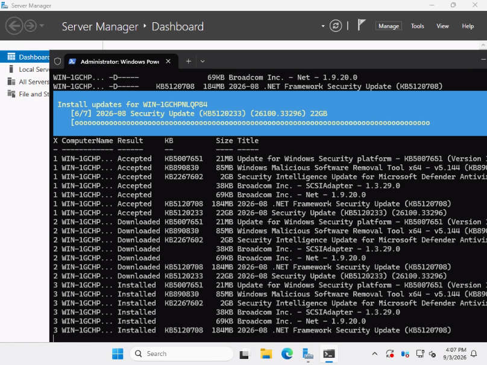

*IMG-018 — Windows Update — Windows Server 2025 (WIN-1GCHPNLQP84)*
