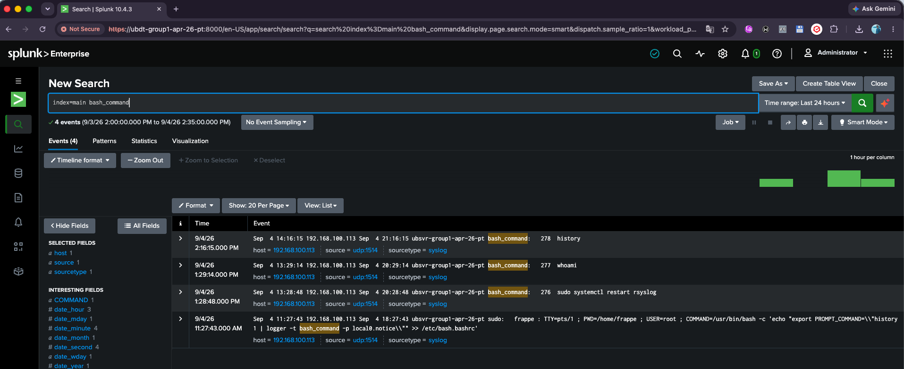

# Linux Log Forwarding

**Host:** Ubuntu Client VM — `192.168.100.113`

Covers `rsyslog`-based forwarding of UFW firewall, authentication, and system error logs to Splunk, plus interactive Bash command auditing forwarded through the same pipeline.

Depends on the receiver configured in [splunk-server-setup.md](splunk-server-setup.md).

---

## Part A: Firewall, Auth & System Log Forwarding

Configure rsyslog to forward UFW firewall, authentication (`auth`/`authpriv`), and system error logs over UDP port 1514.

### 1. Enable Local UFW Logging

**UFW Setup**

```bash
sudo ufw logging low
sudo ufw default deny incoming
sudo ufw reload
```

### 2. Configure Centralized Forwarding Rules

**Rsyslog Config**

Deploy a dedicated rsyslog drop-in configuration pointing to the Splunk host (`192.168.100.120:1514`):

```bash
sudo bash -c 'cat << "EOF" > /etc/rsyslog.d/10-ufw-splunk.conf
# Forward UFW Firewall Logs
:msg, contains, "[UFW " @192.168.100.120:1514

# Forward Authentication Logs (SSH, sudo, su, logins)
auth,authpriv.* @192.168.100.120:1514

# Forward Critical System Messages
*.err;kern.warning @192.168.100.120:1514
EOF'

# Ensure client firewall permits outbound UDP 1514 traffic
sudo ufw allow out 1514/udp

# Restart service
sudo systemctl restart rsyslog
```

---

## Part B: Interactive Command Logging

Captures interactive Bash commands on the Ubuntu host and forwards them to Splunk via rsyslog (`local0` facility), using a `profile.d` script rather than `bash.bashrc` for reliability across login shells.

### 1. Fix `/etc/bash.bashrc`

**Cleanup**

Remove any broken lines at the bottom of `/etc/bash.bashrc`:

```bash
sudo nano /etc/bash.bashrc
```

Then create the logging hook in `/etc/profile.d/` instead — this applies system-wide to all login shells and is safer than editing `bash.bashrc` directly:

```bash
sudo bash -c 'cat << "EOF" > /etc/profile.d/syslog_history.sh
export PROMPT_COMMAND="history 1 | logger -t bash_command -p local0.notice"
EOF'

sudo chmod +x /etc/profile.d/syslog_history.sh
source /etc/profile.d/syslog_history.sh
```

### 2. Route Commands to a Dedicated Log File

**Rsyslog Config**

Create the rsyslog configuration file:

```bash
sudo nano /etc/rsyslog.d/10-bash-splunk.conf
```

Add the rule to direct `local0` events to a dedicated log file:

```
# Filter local0 (bash commands) and output to a dedicated log file
local0.notice /var/log/bash_history.log
& stop
```

Restart rsyslog:

```bash
sudo systemctl restart rsyslog
```

### 3. Test Local Logging

**Verification**

Execute a test command and confirm it's recorded:

```bash
logger -p local0.notice "[CMD TEST] Executed test command from bash"
sudo tail -n 5 /var/log/bash_history.log
```

### 4. Configure Splunk Universal Forwarder to Ingest the Log

**Forwarder Config**

Add the log file as a monitored input in `/opt/splunkforwarder/etc/system/local/inputs.conf`:

```ini
[monitor:///var/log/bash_history.log]
disabled = false
sourcetype = bash_history
index = main
```

Restart the Universal Forwarder:

```bash
sudo /opt/splunkforwarder/bin/splunk restart
```

**Splunk Verification SPL**

Run in Splunk Web (`http://ubdt-group1-apr-26-pt:8000`) to confirm receipt:

```spl
index=main bash_command
```



---

## Part C: ERPNext & Nginx Web Log Forwarding

Forwards ERPNext (Frappe) application errors and Nginx web server errors from this host to the central Splunk indexer, closing the gap between the application layer and the SIEM.

### 1. Enable Splunk Service on Boot

**Enable automatic startup**

Ensure the forwarder starts automatically whenever this server reboots:

```bash
sudo /opt/splunkforwarder/bin/splunk enable boot-start
```

### 2. Point Forwarder to the Central Splunk Server

**Connect receiver**

Connect the forwarder to the central Splunk indexer (default port `9997`):

```bash
sudo /opt/splunkforwarder/bin/splunk add forward-server <SPLUNK_SERVER_IP>:9997
```

### 3. Configure ERPNext & Nginx Log Ingestion

**Log configuration**

Create the local inputs configuration file:

```bash
sudo nano /opt/splunkforwarder/etc/system/local/inputs.conf
```

Add the following stanzas to monitor the ERPNext and Nginx logs:

```ini
[default]
host = ubsvr-group1-apr-26-pt

# --- ERPNext Web Errors ---
[monitor:///home/frappe/erpnext-bench/logs/web.error.log]
disabled = false
sourcetype = frappe:web:error
index = main

# --- ERPNext Background Worker Errors ---
[monitor:///home/frappe/erpnext-bench/logs/worker.error.log]
disabled = false
sourcetype = frappe:worker:error
index = main

# --- Nginx Web Server Errors ---
[monitor:///var/log/nginx/error.log]
disabled = false
sourcetype = nginx:plus:error
index = main
```

### 4. Restart Splunk Forwarder

**Apply settings**

Restart the forwarder to apply the new monitor inputs:

```bash
sudo /opt/splunkforwarder/bin/splunk restart
```

**Splunk Verification**

Confirmed in [pipeline-verification.md](pipeline-verification.md) → "Full-Estate Ingestion Check" — the marked `frappe:web:error` event and the `nginx:plus:error` sourcetype both appear in the estate-wide sourcetype breakdown.

---

*Next: [pipeline-verification.md](pipeline-verification.md) confirms this host's data end to end alongside the Windows hosts.*
