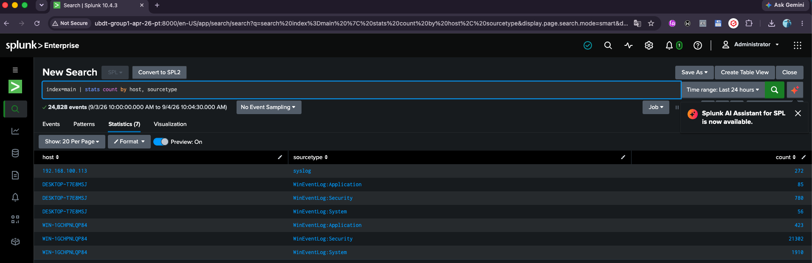
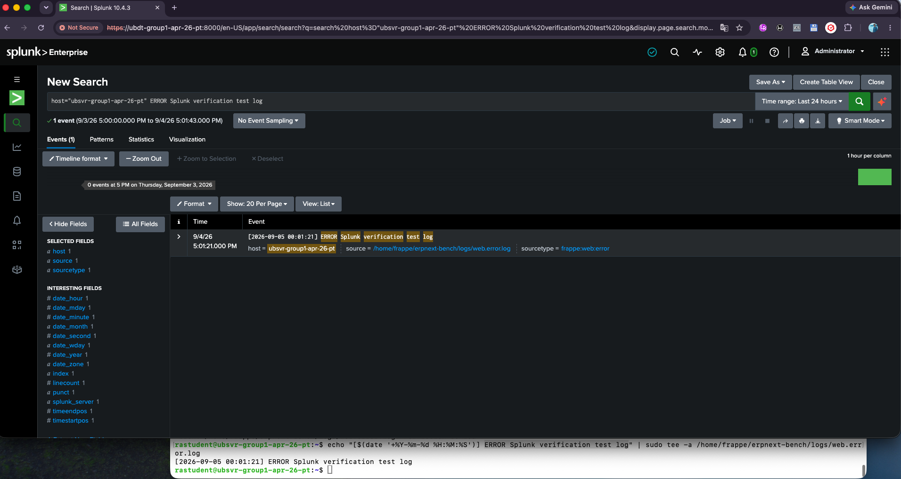
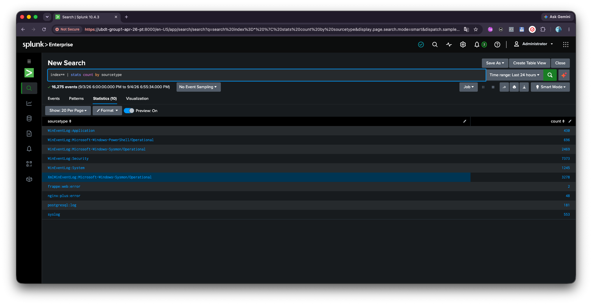

# End-to-End Pipeline Verification

Confirms that the receiver ([splunk-server-setup.md](splunk-server-setup.md)), Linux forwarding ([linux-log-forwarding.md](linux-log-forwarding.md)), and Windows forwarding ([windows-log-forwarding.md](windows-log-forwarding.md)) are actually working together — listeners are active, synthetic events reach Splunk, and every expected host/sourcetype is present.

---

## 1. Verify Network Listeners on Splunk Host

**CLI Diagnostics**

Run `ss` on the Splunk server to verify ports 1514 (UDP) and 9997 (TCP) are active:

```bash
sudo ss -tulnp | grep -E '1514|9997'
```

*Expected output: `splunkd` bound to `0.0.0.0:1514` and `0.0.0.0:9997`.*

## 2. Emit Synthetic Linux Events

**Linux Testing**

Run these commands on the Ubuntu Client VM (`192.168.100.113`):

```bash
# 1. Firewall Test
logger "[UFW BLOCK] Manual firewall verification event"

# 2. Authentication Test
sudo logger -p auth.notice "[AUTH TEST] Manual auth verification event"

# 3. System Critical Test
logger -p daemon.err "[SYS CRITICAL] Manual system error verification event"
```

## 3. Execute Splunk Verification Queries

**Splunk Validation**

Log into Splunk Web (`http://192.168.100.120:8000`) → Search & Reporting (Time Range: Last 15 minutes):

1. Validate Linux stream delivery:
   ```spl
   index=main host="192.168.100.113"
   ```
2. Validate all connected hosts & event breakdown:
   ```spl
   index=main | stats count by host, sourcetype
   ```

**Expected Result Table**

| Host | Sourcetype |
|---|---|
| 192.168.100.113 | syslog |
| DESKTOP-T7E8MSJ | WinEventLog:Application, WinEventLog:Security, WinEventLog:System |
| WIN-1GCHPNLQP84 | WinEventLog:Application, WinEventLog:Security, WinEventLog:System |



---

## 4. Client Workstation Access Setup

If team workstations cannot resolve the hostname `ubdt-group1-apr-26-pt`, add a local DNS entry on Windows 10:

- Open Notepad as Administrator.
- Edit `C:\Windows\System32\drivers\etc\hosts`.
- Add the mapping line:
  ```
  192.168.100.120 ubdt-group1-apr-26-pt
  ```

Access Splunk Web via `http://ubdt-group1-apr-26-pt:8000/`.

---

## 5. Full-Estate Ingestion Check

Beyond the Linux/Windows syslog and event-log paths, confirm application-layer and estate-wide ingestion. The ERPNext and Nginx monitor stanzas that produce this data are configured in [linux-log-forwarding.md](linux-log-forwarding.md) → "Part C: ERPNext & Nginx Web Log Forwarding".

**ERPNext log ingested to Splunk**



**All log types forwarded to Splunk**


