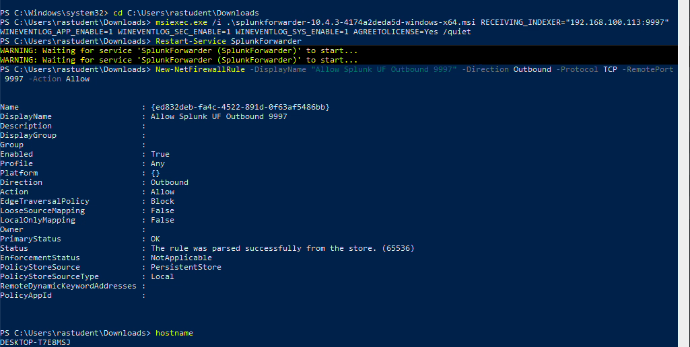
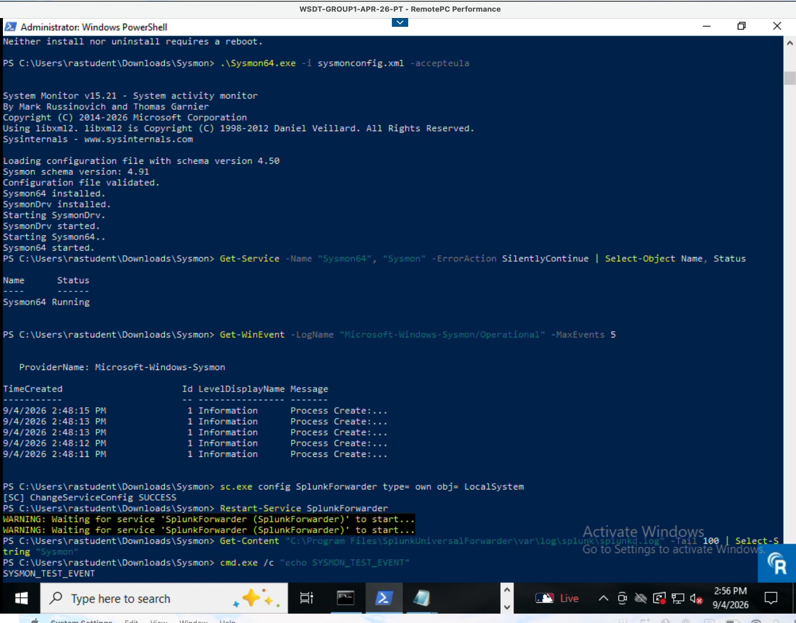
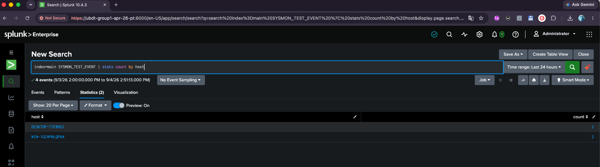

# Windows Log Forwarding

**Hosts:** Windows 10 & Windows Server 2025

Covers deploying the Splunk Universal Forwarder for standard Windows Event Logs, then extending it with Sysmon and PowerShell auditing for deeper endpoint telemetry.

Depends on the receiver configured in [splunk-server-setup.md](splunk-server-setup.md).

---

## Part A: Universal Forwarder & Standard Event Logs

Deploy the Splunk Universal Forwarder (UF) to send Application, Security, and System event logs over TCP port 9997.

### 1. Install Splunk Universal Forwarder

**Agent Deployment**

Open PowerShell as Administrator on each Windows node and run the unattended installation:

```powershell
msiexec.exe /i C:\temp\splunkuniversalforwarder-x64.msi RECEIVING_INDEXER="192.168.100.120:9997" WINEVENTLOG_APP_ENABLE=1 WINEVENTLOG_SEC_ENABLE=1 WINEVENTLOG_SYS_ENABLE=1 AGREETOLICENSE=Yes /quiet
```

### 2. Customize Event Log Inputs

**Log Channels**

Ensure log definitions exist in `C:\Program Files\SplunkUniversalForwarder\etc\system\local\inputs.conf`:

```ini
[WinEventLog://Application]
disabled = 0
index = main

[WinEventLog://Security]
disabled = 0
index = main

[WinEventLog://System]
disabled = 0
index = main
```

Restart the service to apply changes:

```powershell
Restart-Service SplunkForwarder
```

### 3. Allow Outbound Forwarder Port

**Windows Firewall**

Open outbound TCP port 9997 in Windows Defender Firewall:

```powershell
New-NetFirewallRule -DisplayName "Allow Splunk UF Outbound 9997" -Direction Outbound -Protocol TCP -RemotePort 9997 -Action Allow
```



---

## Part B: Sysmon & PowerShell Auditing

Installs Microsoft Sysmon, enables command-line and PowerShell script block auditing, fixes Splunk Universal Forwarder service permissions, and verifies event ingestion.

### 1. Enable Process Creation & PowerShell Auditing

**PowerShell (Run as Administrator)**

Enable Process Creation auditing (Event ID 4688) and Script Block Logging (Event ID 4104):

```powershell
# Enable Process Creation Auditing
auditpol /set /subcategory:"Process Creation" /success:enable /failure:enable

# Include Command Line arguments in Event ID 4688
Set-ItemProperty -Path "HKLM:\SOFTWARE\Microsoft\Windows\CurrentVersion\Policies\System\Audit" -Name "ProcessCreationIncludeCmdLine_Enabled" -Value 1 -Type DWord

# Enable Script Block Logging for PowerShell
$PSPath = "HKLM:\SOFTWARE\Policies\Microsoft\Windows\PowerShell\ScriptBlockLogging"
If (-not (Test-Path $PSPath)) { New-Item -Path $PSPath -Force }
Set-ItemProperty -Path $PSPath -Name "EnableScriptBlockLogging" -Value 1 -Type DWord
```

### 2. Install & Verify Sysmon Service

**Install Sysmon with Config**

Download Sysmon and a configuration file into `C:\Sysmon`, then run:

```powershell
Invoke-WebRequest -Uri "https://raw.githubusercontent.com/SwiftOnSecurity/sysmon-config/master/sysmonconfig-export.xml" -OutFile "C:\Users\Administrator\Downloads\Sysmon\sysmonconfig.xml"

cd C:\Sysmon
.\Sysmon64.exe -i sysmonconfig.xml -accepteula
```

**Verify Service & Event Channel**

Confirm the service is active and generating events locally:

```powershell
# Check service status
Get-Service -Name "Sysmon64", "Sysmon" -ErrorAction SilentlyContinue | Select-Object Name, Status

# Check for local events
Get-WinEvent -LogName "Microsoft-Windows-Sysmon/Operational" -MaxEvents 5
```

### 3. Configure Splunk Universal Forwarder

**Step A: Update `inputs.conf`**

Edit `C:\Program Files\SplunkUniversalForwarder\etc\system\local\inputs.conf` and append the monitoring stanzas:

```ini
# Windows Security Log (Captures CMD Executions via Event ID 4688)
[WinEventLog://Security]
disabled = 0
start_from = oldest
current_only = 0
evt_resolve_ad = 1
checkpointInterval = 5
whitelist = 4688
index = main

# PowerShell Script Block Logging (Event ID 4104)
[WinEventLog://Microsoft-Windows-PowerShell/Operational]
disabled = 0
start_from = oldest
current_only = 0
checkpointInterval = 5
whitelist = 4104
index = main

# Microsoft Sysmon Operational Log
[WinEventLog://Microsoft-Windows-Sysmon/Operational]
disabled = 0
start_from = oldest
current_only = 0
checkpointInterval = 5
render_xml = true
index = main
```

**Step B: Elevate Forwarder Service Permissions (Critical)**

By default, the forwarder runs as `NT SERVICE\SplunkForwarder`, which lacks permission to read protected channels like Sysmon. Reconfigure the service to run as `LocalSystem`:

```powershell
# Change SplunkForwarder service logon account to LocalSystem
sc.exe config SplunkForwarder type= own obj= LocalSystem

# Restart the service to apply changes
Restart-Service SplunkForwarder
```



### 4. Troubleshooting & Verification

**Step A: Check Internal Logs for Access Errors**

If events do not appear in Splunk, inspect the forwarder log for permission-denied or channel errors:

```powershell
Get-Content "C:\Program Files\SplunkUniversalForwarder\var\log\splunk\splunkd.log" -Tail 100 | Select-String "Sysmon"
```

**Step B: Trigger Test Event**

Generate an interactive command execution on the Windows host:

```cmd
cmd.exe /c "echo SYSMON_TEST_EVENT"
```

**Step C: Verify Ingest in Splunk Web**

Log into Splunk Web (`http://ubdt-group1-apr-26-pt:8000`) and run the following queries (set time range to All Time):



| Target Logs | Verification SPL Query |
|---|---|
| Test Trigger | `index=main "SYSMON_TEST_EVENT"` |
| Sysmon Events | `index=main sourcetype="XmlWinEventLog:Microsoft-Windows-Sysmon/Operational" \| table _time, host, EventCode, Image, CommandLine` |
| PowerShell ScriptBlock | `index=main EventCode=4104 \| table _time, host, ScriptBlockText` |

---

*Next: [pipeline-verification.md](pipeline-verification.md) confirms these hosts' data end to end alongside the Linux host.*
