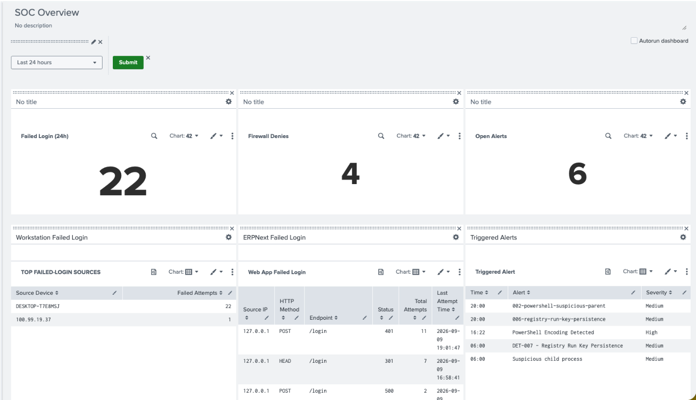

# Dashboards

Panels built for the SOC homelab dashboard. Each entry documents the panel's purpose and SPL.



---

## Failed Login (single value)

**Purpose:** 24-hour count of failed Windows logon attempts.

```spl
index=main
| where _time >= relative_time(now(), "-24h")
| search EventCode=4625
| stats count
```

---


## Firewall Denies (single value)

**Purpose:** Count of firewall deny/block events.

```spl
index=main
| search "deny" OR "denied" OR "block" OR "blocked"
| stats count
```

---

## Open Alerts

**Purpose:** Count of currently fired (unexpired) alerts.

**Prerequisite for non-admin users:** Settings → Roles → select your role → **Indexes searched by default** → ensure `_audit` and `_internal` are included.

```spl
| rest /servicesNS/-/-/alerts/fired_alerts
| table title
| stats count by title
| stats sum(count)
```

---

## Top Failed-Login Sources

**Purpose:** Ranks the top 10 sources generating failed authentication events, using the CIM Authentication data model.

```spl
| datamodel Authentication Authentication search
| search Authentication.action="failure"
| stats count by Authentication.src
| rename Authentication.src as "Source Device", count as "Failed Attempts"
| sort - "Failed Attempts"
| head 10
```

---

## Triggered Alert (table)

**Purpose:** Lists currently open (unexpired) triggered alerts with trigger time and severity, since `fired_alerts` at the collection level only returns alert names/counts — per-alert detail requires a follow-up `map` call per savedsearch.

```spl
| rest /servicesNS/-/-/alerts/fired_alerts
| search title!="-"
| rename title AS savedsearch_name
| eval encoded_name=replace(savedsearch_name, " ", "%20")
| map search="| rest /servicesNS/-/-/alerts/fired_alerts/$encoded_name$"
| eval expiration_epoch=strptime(expiration_time_rendered, "%Y-%m-%d %H:%M:%S %Z")
| where expiration_epoch > now()
| eval trigger_epoch=strptime(published, "%Y-%m-%dT%H:%M:%S%z")
| eval Time=strftime(trigger_epoch, "%H:%M")
| eval Severity=case(severity=1,"Info", severity=2,"Low", severity=3,"Medium", severity=4,"High", severity=5,"Critical", 1=1,"Unknown")
| rename savedsearch_name AS Alert
| table Time, Alert, Severity
| sort - Time
```

**Note:** `savedsearch_name` values containing spaces must be URL-encoded (`replace(savedsearch_name, " ", "%20")`) before being substituted into the `map` subsearch, or that alert's detail lookup silently returns nothing.

---

## Outbound Network Activity

**Purpose:** Top 10 outbound network connections by volume, from Sysmon network-connection events.

```spl
sourcetype="*Sysmon*" EventCode=3
| stats count, max(_time) as last_seen by SourceIp, DestinationIp, DestinationPort, Image
| fieldformat last_seen=strftime(last_seen, "%Y-%m-%d %H:%M:%S")
| rename SourceIp as "Source IP", DestinationIp as "Destination IP", DestinationPort as "Port", Image as "Process", count as "Total Connections", last_seen as "Last Event"
| sort - "Total Connections"
| head 10
```

---

## Suspicious PowerShell 24h (table)

**Purpose:** Dashboard-friendly presentation of the encoded-command/download-and-execute PowerShell detection (see `detections.md` #4), with readable column names and truncated command lines.

```spl
index=* EventCode=1
(Image="*\\powershell.exe" OR Image="*\\pwsh.exe")
| where match(CommandLine,"(?i)(^|\s)-(e|enc|encodedcommand)(\s|$)")
   OR match(CommandLine,"(?i)(Invoke-WebRequest|Invoke-RestMethod|DownloadString|DownloadFile)")
| eval Time_Formatted=strftime(_time, "%Y-%m-%d %H:%M:%S")
| eval User=coalesce(User, TargetUserName, SecurityID, "Unknown")
| eval ParentProcess=mvindex(split(ParentImage, "\\"), -1)
| eval CommandLine_Truncated=if(len(CommandLine) > 150, substr(CommandLine, 1, 150) . "...", CommandLine)
| eval Detection="Suspicious PowerShell Execution"
| table Time_Formatted host User Detection Image CommandLine_Truncated ParentProcess ProcessId
| rename Time_Formatted as "Timestamp", host as "Host / Endpoint", User as "User Account", Detection as "Alert Category", Image as "Executed Image", CommandLine_Truncated as "Command Line", ParentProcess as "Parent Process", ProcessId as "PID"
| sort - "Timestamp"
```
