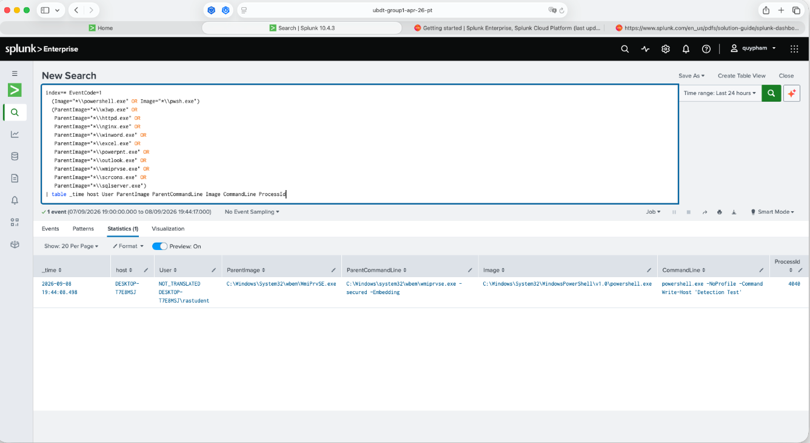
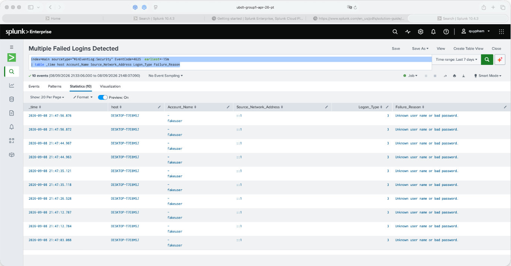
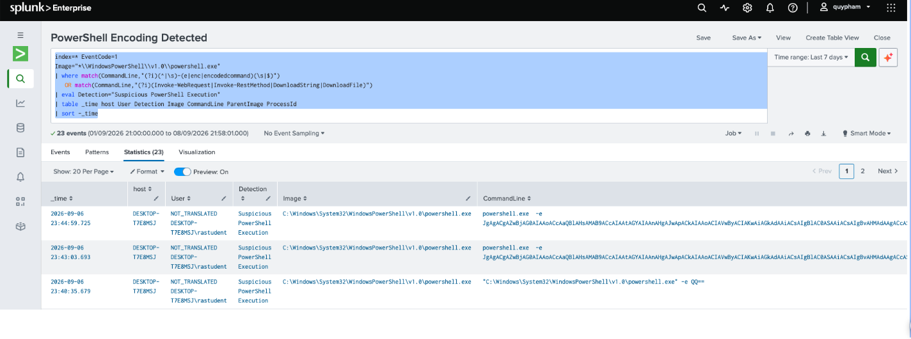

# Detections

Detection rules implemented as Splunk alerts for the SOC homelab. Each entry documents the SPL logic, data source, and MITRE ATT&CK mapping.

---

## 1. PowerShell — Suspicious Parent Process

**MITRE ATT&CK:** T1059.001 (Command and Scripting Interpreter: PowerShell), T1204 (User Execution)

**Data source:** Sysmon Event ID 1 (Process Creation)

**Logic:** Flags PowerShell/`pwsh` processes whose parent is a process that should not normally spawn a shell — web server workers, Office applications, WMI, or SQL Server. This pattern is common in web-shell exploitation (`w3wp.exe`, `httpd.exe`, `nginx.exe`), malicious macro execution (`winword.exe`, `excel.exe`, `powerpnt.exe`, `outlook.exe`), and WMI/SQL-based lateral movement or persistence (`wmiprvse.exe`, `scrcons.exe`, `sqlserver.exe`).

```spl
index=* EventCode=1
(Image="*\\powershell.exe" OR Image="*\\pwsh.exe")
(ParentImage="*\\w3wp.exe" OR
 ParentImage="*\\httpd.exe" OR
 ParentImage="*\\nginx.exe" OR
 ParentImage="*\\winword.exe" OR
 ParentImage="*\\excel.exe" OR
 ParentImage="*\\powerpnt.exe" OR
 ParentImage="*\\outlook.exe" OR
 ParentImage="*\\wmiprvse.exe" OR
 ParentImage="*\\scrcons.exe" OR
 ParentImage="*\\sqlserver.exe")
| table _time host User ParentImage ParentCommandLine Image CommandLine ProcessId
```



**Tuning notes:** Legitimate admin tooling (some EDR agents, patch management software) can spawn PowerShell from unusual parents — allowlist known-good parent/child pairs per host if false positives appear.

---

## 2. Registry Run Key Persistence

**MITRE ATT&CK:** T1547.001 (Boot or Logon Autostart Execution: Registry Run Keys / Startup Folder)

**Data source:** Sysmon Event ID 12/13 (Registry object create/modify) via `WinEventLog:Microsoft-Windows-Sysmon/Operational` or `XmlWinEventLog:Microsoft-Windows-Sysmon/Operational`

**Logic:** Flags writes to the classic Run / RunOnce / Explorer\Run autostart registry keys — a common mechanism for malware to survive reboot.

```spl
index=main
(sourcetype="WinEventLog:Microsoft-Windows-Sysmon/Operational" OR sourcetype="XmlWinEventLog:Microsoft-Windows-Sysmon/Operational")
EventCode IN (12, 13)
TargetObject IN (
    "*\\Software\\Microsoft\\Windows\\CurrentVersion\\Run*",
    "*\\Software\\Microsoft\\Windows\\CurrentVersion\\RunOnce*",
    "*\\Software\\Microsoft\\Windows\\CurrentVersion\\Policies\\Explorer\\Run*"
)
| table _time Computer User EventCode Image TargetObject Details
```


**Tuning notes:** Legitimate software installers write to Run keys too — cross-reference `Image` against a known-software baseline before escalating.

---

## 3. Multiple Failed Logins

**MITRE ATT&CK:** T1110 (Brute Force)

**Data source:** Windows Security Event Log, EventCode 4625 (failed logon)

**Logic:** Surfaces failed logon attempts in a short rolling window to catch brute-force or password-spray activity.

```spl
index=main sourcetype="WinEventLog:Security" EventCode=4625 earliest=-15m
| table _time host Account_Name Source_Network_Address Logon_Type Failure_Reason
```



**Tuning notes:** No count/threshold is enforced in this version — it lists raw failures. Consider adding `| stats count by Account_Name, Source_Network_Address | where count > N` to alert only on repeated failures rather than every single one.

---

## 4. PowerShell Encoded Command / Suspicious Execution

**MITRE ATT&CK:** T1059.001 (PowerShell), T1027 (Obfuscated Files or Information), T1105 (Ingress Tool Transfer)

**Data source:** Sysmon Event ID 1 (Process Creation)

**Logic:** Flags PowerShell invocations using Base64-encoded commands (`-enc` / `-EncodedCommand`) — a common obfuscation technique — or commands that download and execute remote content (`Invoke-WebRequest`, `Invoke-RestMethod`, `DownloadString`, `DownloadFile`).

```spl
index=* EventCode=1
Image="*\\WindowsPowerShell\\v1.0\\powershell.exe"
| where match(CommandLine,"(?i)(^|\s)-(e|enc|encodedcommand)(\s|$)")
   OR match(CommandLine,"(?i)(Invoke-WebRequest|Invoke-RestMethod|DownloadString|DownloadFile)")
| eval Detection="Suspicious PowerShell Execution"
| table _time host User Detection Image CommandLine ParentImage ProcessId
| sort -_time
```



**Tuning notes:** Only matches the default `v1.0\powershell.exe` path — add `pwsh.exe` (PowerShell 7) if that's in use in the environment. The dashboard version of this detection (see `dashboards.md` — "Suspicious PowerShell 24h") adds field renaming, truncated command-line display, and a `User` coalesce for readability.
