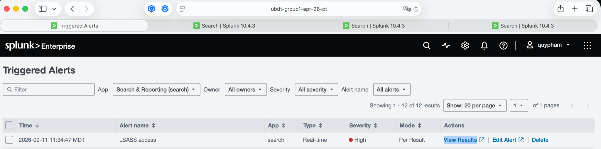
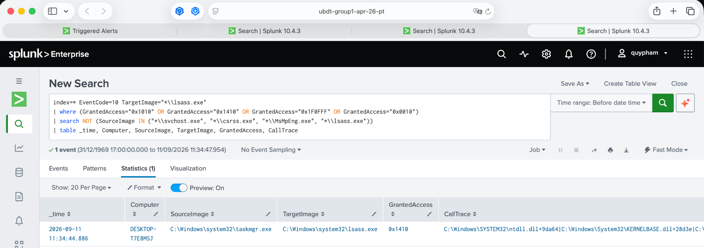
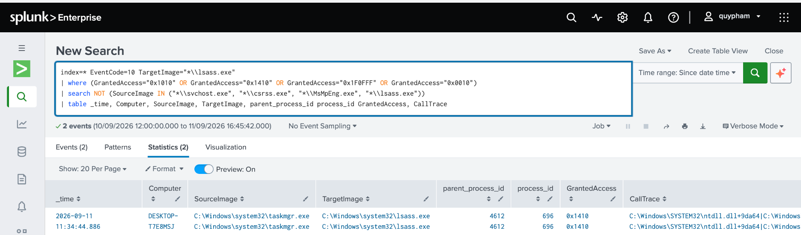
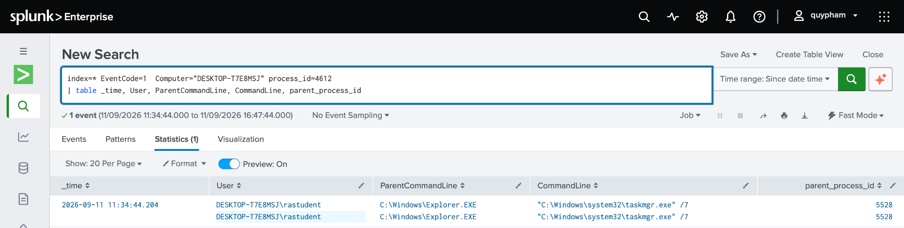
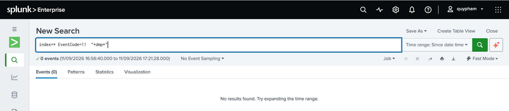
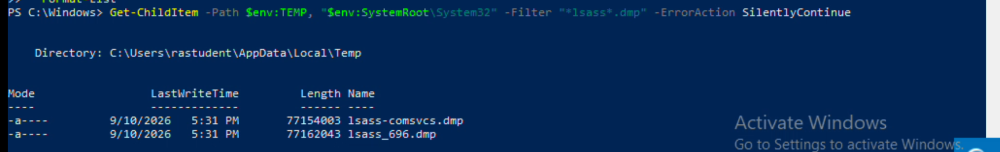

# Full Investigation — LSASS Credential Dumping Alert

> **Summary/verdict:** see [README.md](./README.md)

**Test Executed:** `Invoke-AtomicTest T1003.001 -TestNumbers 1`
**MITRE ATT&CK:** T1003.001 — OS Credential Dumping: LSASS Memory

---

## Step 1: Alert Triggered

Sysmon EventCode 10 (ProcessAccess) fired in Splunk following the atomic test execution.



---

## Step 2: Reviewing GrantedAccess Detail

Investigated the `GrantedAccess` mask (`0x1410`) on the ProcessAccess event. This mask includes `PROCESS_VM_READ` — the access right required to **read memory contents** out of another process — which is exactly what's required to scrape credentials (password hashes, Kerberos tickets, plaintext secrets in memory) out of `lsass.exe`.



---

## Step 3: Pivoting to Find the Source Process (taskmgr.exe PID)

Using the existing data (time and computer), pivoted to identify the process ID of `taskmgr.exe` that accessed `lsass.exe`.



---

## Step 4: Identifying the Parent Process

From the process ID of `taskmgr.exe`, traced the parent process — found to be `explorer.exe`. This indicates the access could be either a legitimate admin opening Task Manager via Windows Search, or an attacker doing the same interactively. To determine malicious intent, the next step is to confirm whether a dump file was actually created.



---

## Step 5: Searching for Dump File Creation (EventCode 11)

Attempted to search for file creation events matching `.dmp` — no results returned. Even broadening the search to all EventCode=11 events for all time returned empty.



---

## Step 6: Confirming Dump File via PowerShell

Since Sysmon FileCreate logging returned nothing, used direct filesystem verification instead:

```powershell
Get-ChildItem -Path $env:TEMP, "$env:SystemRoot\System32" -Filter "*lsass*.dmp" -ErrorAction SilentlyContinue
```

This returned results, confirming dump files were present on disk — revealing a **Sysmon configuration gap**: FileCreate events for `.dmp` files were not being captured and need to be configured.



---

## Conclusion

**Verdict: True Positive**

Attacker (or simulated atomic test) logged in interactively, opened Task Manager, and dumped LSASS memory, saving the output to:

- `C:\Users\rastudent\AppData\Local\Temp\lsass-comsvcs.dmp`
- `C:\Users\rastudent\AppData\Local\Temp\lsass_696.dmp`

**Detection gap identified:** Sysmon was not configured to log all relevant FileCreate (EventCode 11) events, requiring manual filesystem verification to confirm the dump. Sysmon config should be updated to capture `.dmp` file creation going forward.
