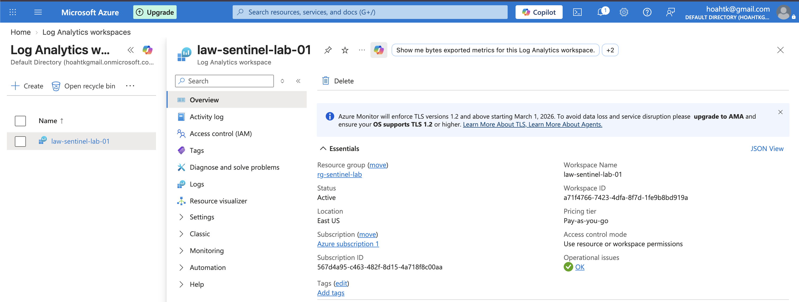
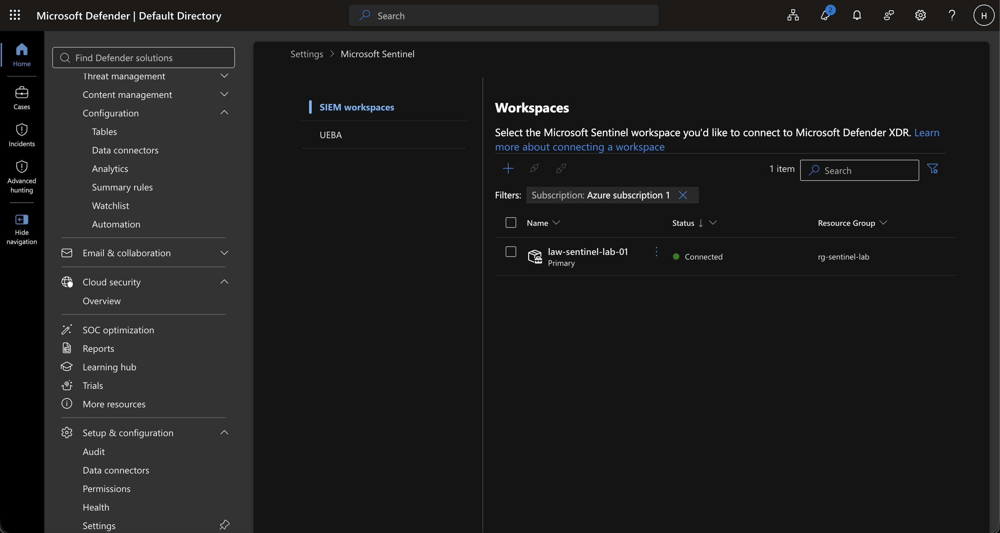
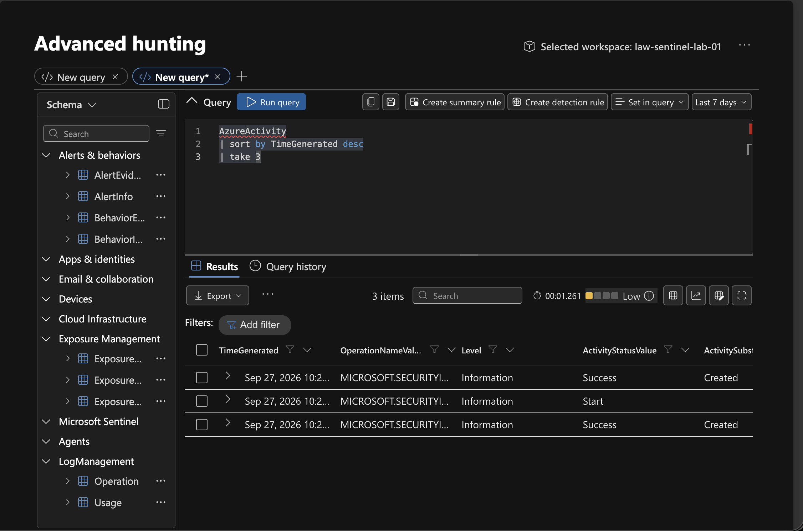

## Environment Setup


### Log Analytics Workspace

A Log Analytics workspace was created to act as the central repository for security telemetry collected from the lab environment.

- Workspace: `law-sentinel-lab`
- Resource Group: `rg-sentinel-lab`
- Region: `West US`
- Purpose: Store and query security logs using KQL.




### Microsoft Sentinel

Microsoft Sentinel was enabled on the Log Analytics workspace to provide SIEM and security operations capabilities.

The workspace is used for:

- Security event collection
- KQL-based investigation
- Threat hunting
- Analytics rules
- Alert generation
- Incident investigation



### Data Ingestion Verification

To verify that Microsoft Sentinel was successfully receiving data, a KQL query was executed against the Log Analytics workspace. The returned `AzureActivity` events confirmed that Azure activity logs were being ingested and were available for analysis in Sentinel.

```kusto
AzureActivity
| sort by TimeGenerated desc
| take 3
```


