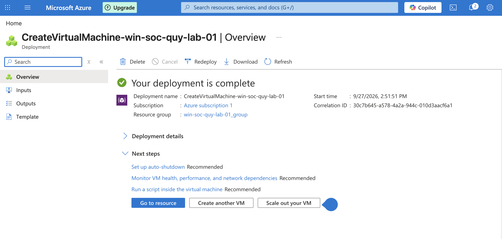
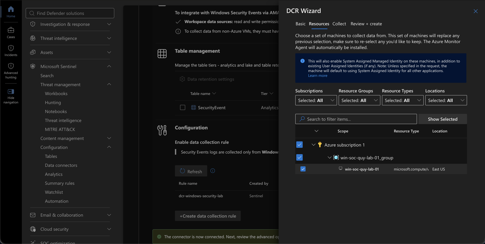
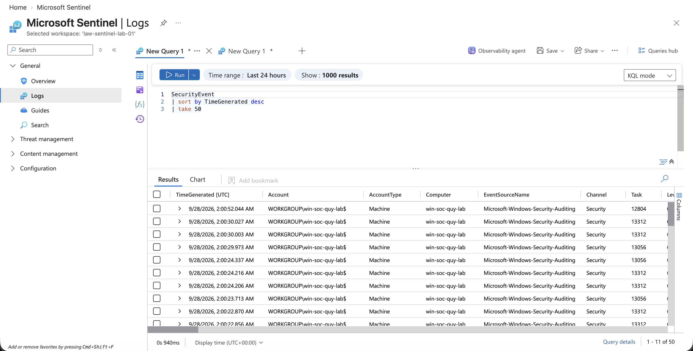
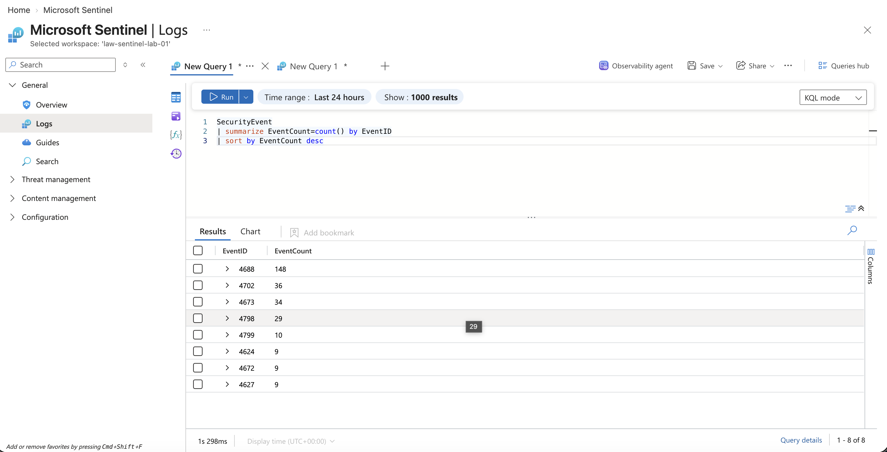

# Windows Security Log Collection

## Objective

The purpose of this phase was to connect a Windows endpoint to Microsoft Sentinel and collect Windows Security events for security monitoring and investigation.

The logging pipeline used in the lab is:

```text
Windows Endpoint
        ↓
Azure Monitor Agent (AMA)
        ↓
Data Collection Rule (DCR)
        ↓
Log Analytics Workspace
        ↓
Microsoft Sentinel
```

## Windows Endpoint

A Windows virtual machine was deployed as the monitored endpoint for the SOC lab.

- Hostname: `win-soc-quy-lab-01`
- Platform: Windows Server
- Purpose: Generate endpoint and authentication telemetry for Sentinel investigation exercises.



## Windows Security Events Connector

The **Windows Security Events via AMA** data connector was configured in Microsoft Sentinel.

Azure Monitor Agent was used to forward Windows Security events from the monitored endpoint into the Sentinel Log Analytics workspace.

A Data Collection Rule was created to define:

- The monitored Windows endpoint
- The Windows events to collect
- The destination Log Analytics workspace

### Data Collection Rule

- DCR: `dcr-windows-security-lab`
- Endpoint: `win-soc-quy-lab-01`
- Destination: `law-sentinel-lab-01`
- Data source: Windows Security Events




## Data Ingestion Verification

KQL was used to confirm that Windows Security events were successfully reaching Microsoft Sentinel.

```kusto
SecurityEvent
| sort by TimeGenerated desc
| take 50
```

The returned events confirmed that Windows Security telemetry was being ingested into the `SecurityEvent` table.




The event distribution was also reviewed using:

```kusto
SecurityEvent
| summarize EventCount=count() by EventID
| sort by EventCount desc
```

This provided an initial understanding of the types and volume of Windows Security events available for investigation.



## Outcome

The Windows endpoint was successfully connected to Microsoft Sentinel, and Windows Security events were available for KQL-based analysis.

This established the endpoint telemetry required for subsequent alert triage, threat hunting, detection engineering, and incident investigation exercises.