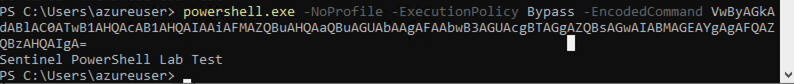
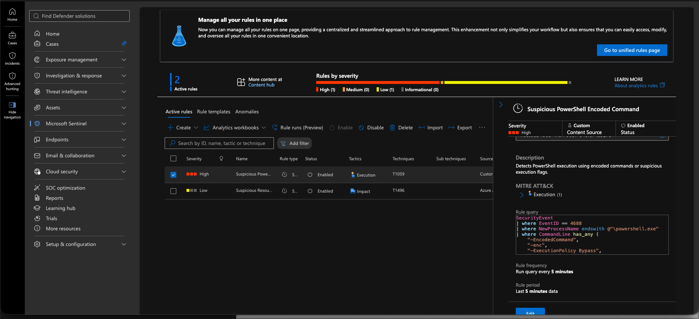
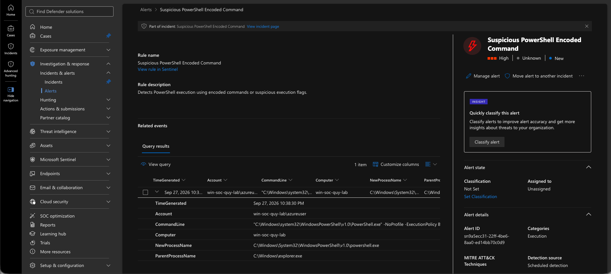
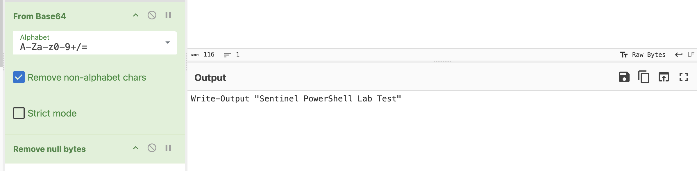
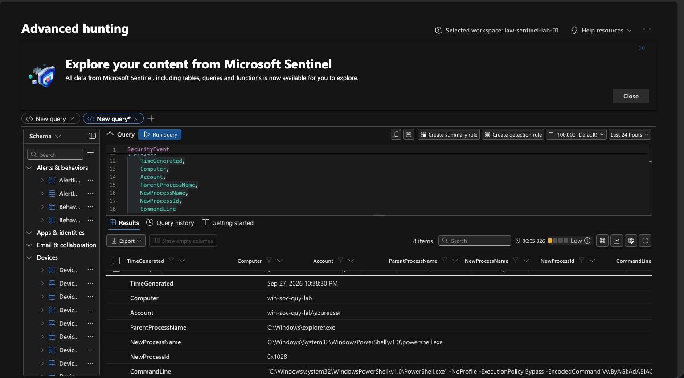
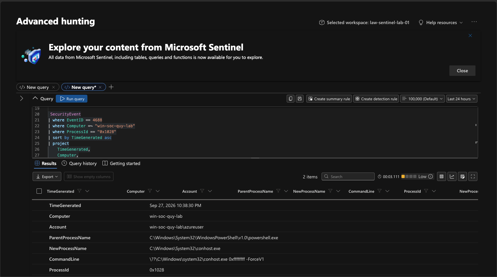
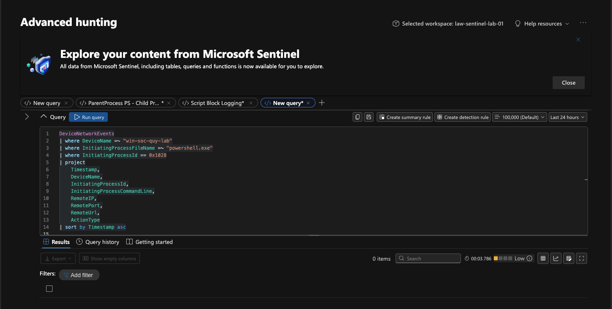

# Suspicious PowerShell Investigation

## Table of Contents

- [Goal](#goal)
- [Investigation Flow](#investigation-flow)
- [What I Did](#what-i-did)
  - [1. Generate Suspicious PowerShell Activity](#1-generate-suspicious-powershell-activity)
  - [2. Hunt for Suspicious PowerShell](#2-hunt-for-suspicious-powershell)
  - [3. Create a Sentinel Analytics Rule](#3-create-a-sentinel-analytics-rule)
  - [4. Generate the Alert](#4-generate-the-alert)
- [Triage and Investigation](#triage-and-investigation)
  - [1. Decode the PowerShell Command](#1-decode-the-powershell-command)
  - [2. Review Parent Process and PowerShell Process ID](#2-review-parent-process-and-powershell-process-id)
  - [3. Check Child Processes](#3-check-child-processes)
  - [4. Check Network Connections](#4-check-network-connections)
  - [5. Classify the Alert](#5-classify-the-alert)
- [Outcome](#outcome)
- [What I Learned](#what-i-learned)

---

## Goal

The goal of this lab was to detect and investigate suspicious PowerShell activity in Microsoft Sentinel using Windows process creation logs and KQL.

The test focused on PowerShell executions using suspicious flags such as:

- `-EncodedCommand`
- `-ExecutionPolicy Bypass`
- `-NoProfile`
- `-WindowStyle Hidden`

The objective was to practice the SOC workflow from detection through triage, investigation, scoping, classification, and documentation.


---

## Investigation Flow

```text
Encoded PowerShell Alert
        ↓
Decode Command
        ↓
Review Parent Process
        ↓
Identify PowerShell PID
        ↓
Check Child Processes
        ↓
Check Network Activity
        ↓
Classify the Alert
```

---

## What I Did

### 1. Generate Suspicious PowerShell Activity

I generated a harmless encoded PowerShell command on a monitored Windows endpoint to create realistic security telemetry.

```powershell
$Command = 'Write-Output "Sentinel PowerShell Lab Test"'
$Bytes = [System.Text.Encoding]::Unicode.GetBytes($Command)
$Encoded = [Convert]::ToBase64String($Bytes)
$Encoded
```

The encoded command was then executed with suspicious PowerShell flags.



---

### 2. Hunt for Suspicious PowerShell

I created a KQL query to identify PowerShell processes using suspicious command-line arguments.

```kusto
SecurityEvent
| where EventID == 4688
| where NewProcessName endswith @"\powershell.exe"
| where CommandLine has_any (
    "-EncodedCommand",
    "-enc",
    "-ExecutionPolicy Bypass",
    "-WindowStyle Hidden"
)
| project
    TimeGenerated,
    Computer,
    Account,
    ParentProcessName,
    NewProcessName,
    NewProcessId,
    CommandLine
```

This query allowed me to identify the suspicious PowerShell execution and retrieve the process ID for further investigation.

---

### 3. Create a Sentinel Analytics Rule

I converted the hunting query into a custom Scheduled Analytics Rule in Microsoft Sentinel.



---

### 4. Generate the Alert

After enabling the analytics rule, I executed the test command again.

```powershell
powershell.exe -NoProfile -ExecutionPolicy Bypass -EncodedCommand VwByAGkAdABlAC0ATwB1AHQAcAB1AHQAIAAiAFMAZQBuAHQAaQBuAGUAbAAgAFAAbwB3AGUAcgBTAGgAZQBsAGwAIABMAGEAYgAgAFQAZQBzAHQAIgA=
```

The decoded command produced:

```text
Sentinel PowerShell Lab Test
```

Microsoft Sentinel detected the activity and generated an alert.



---

## Triage and Investigation

### 1. Decode the PowerShell Command

The first step was to decode the `-EncodedCommand` value to understand what the PowerShell command was attempting to execute.



The decoded command was:

```powershell
Write-Output "Sentinel PowerShell Lab Test"
```

This showed that the command itself was harmless and was intentionally generated for the lab.

---

### 2. Review Parent Process and PowerShell Process ID

I reviewed the process creation event to identify:

- The process that launched PowerShell
- The PowerShell process ID
- The full command line

The parent process was `explorer.exe`, which is a legitimate Windows process running from its expected system path.



The PowerShell process ID was:

```text
0x1028
```

---

### 3. Check Child Processes

I used the PowerShell process ID to search for processes created by that specific PowerShell instance.

```kusto
SecurityEvent
| where EventID == 4688
| where Computer =~ "win-soc-quy-lab"
| where ProcessId == "0x1028"
| sort by TimeGenerated asc
| project
    TimeGenerated,
    Computer,
    Account,
    ParentProcessName,
    NewProcessName,
    CommandLine,
    ProcessId,
    NewProcessId
```

The PowerShell process created only `conhost.exe`.

`conhost.exe` is the legitimate Windows Console Host process and is commonly associated with command-line applications.

No additional suspicious child processes were observed during the investigation window.



---

### 4. Check Network Connections

I also checked whether the PowerShell process established any network connections.



No network connections associated with the investigated PowerShell process were observed.

---


### 5. Classify the Alert

After reviewing the decoded command, parent process, child processes, and network activity, I classified the alert based on the available evidence.

**Classification:** `Expected Activity / Authorized Security Test`

**Reasoning:**

- The PowerShell command used suspicious flags and correctly triggered the analytics rule.
- The encoded command decoded to a harmless `Write-Output` test command.
- The parent process was the legitimate `explorer.exe` process.
- The only child process observed was `conhost.exe`, a normal Windows Console Host process.
- No additional suspicious child processes were identified.
- No network connections associated with the investigated PowerShell process were observed.
- The activity was intentionally generated as part of the lab.

The alert was therefore a valid detection, but the underlying activity was authorized and benign.

In a production environment, I would only close the alert after confirming that the activity was expected or authorized. If the command, process tree, network activity, or other evidence indicated malicious behavior, I would escalate the incident for further investigation and containment.

---

## Outcome

The alert was successfully generated and investigated using Microsoft Sentinel and KQL.

The investigation found:

- The PowerShell command used suspicious execution flags.
- The encoded command decoded to a harmless test command.
- The parent process was a legitimate `explorer.exe` process.
- The only observed child process was `conhost.exe`.
- No suspicious child processes were identified.
- No network connections were observed for the investigated PowerShell process.

Because the activity was intentionally generated for the lab and no malicious follow-on behavior was identified, the activity was classified as an **authorized security test / expected activity**.

---

## What I Learned

This lab helped me practice the full workflow of investigating suspicious PowerShell activity in Microsoft Sentinel.

I learned how to:

- Detect suspicious PowerShell execution using Windows Event ID `4688`
- Write KQL queries for PowerShell hunting
- Create a custom Sentinel analytics rule
- Identify the parent process and process ID
- Correlate a PowerShell PID with its child processes
- Check for follow-on network activity
- Use multiple pieces of evidence before classifying an alert

I also learned an important KQL troubleshooting lesson:

When I manually added a timestamp condition while searching for child processes, the query returned no results because the timestamp displayed in the Sentinel interface was in local time while the KQL `datetime()` value was interpreted in UTC.

To avoid this issue, I learned to either:

- derive the timestamp directly from the event, or
- use the process ID first and then apply a time window carefully.

