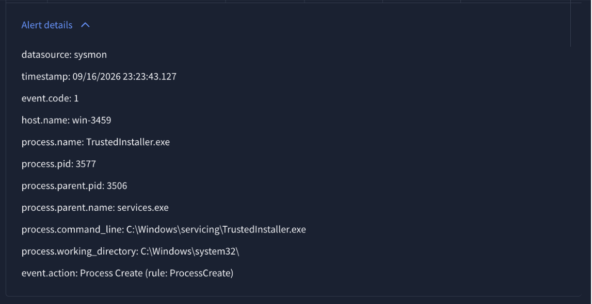
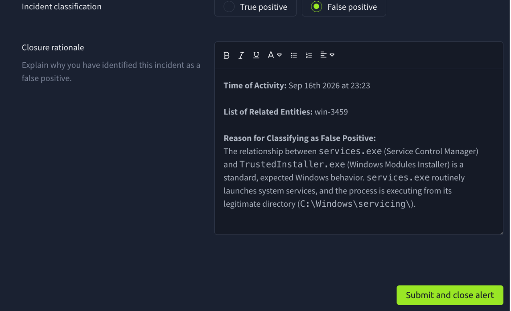

**Verdict:** False Positive — Suspicious Parent Child relationship


## Alert



## Investigation

Query used to check for downstream activity from the flagged process:
```
host.name="win-3459" (process.pid=3577 OR parent.process.pid=3577)
earliest="09/16/2026:23:23:43" latest="09/16/2026:23:53:43"
```
Result: Single event returned (event.code=1, the original process creation). No child processes and no network connection events (or any other event type) associated with PID 3577 or spawned from it within the search window, indicating TrustedInstaller.exe took no further action after creation.

Note: Digital signature verification was not performed, as this SIEM does not ingest Sysmon EventCode=7 (Image Load) and no signature field is present on the ProcessCreate event. Legitimacy was assessed based on file path (`C:\Windows\servicing\`), working directory (`C:\Windows\system32\`), and the standard, expected parent-child relationship with `services.exe`.

## Case Report



